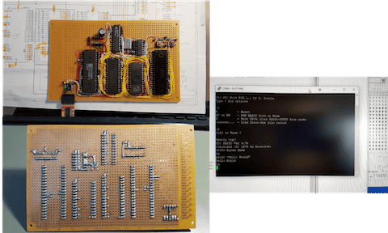
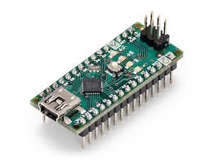
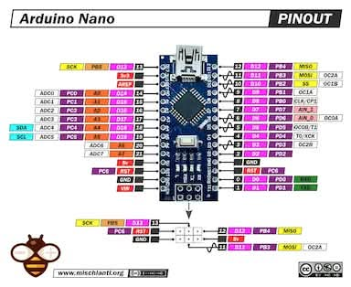

# Topic 1: Arduino

Great Idea for Beginners of Embedded Systems

---

Comment:

- In the AI age, you should understand the concepts based on an isolated entity: topics.

- Then, you need to integreate multiple topics to solve real-world problems.

- Your 2nd brain should be optimized for that: connecting topics to solve problems.

---

## Questions

1. Why is an Arudino board so popular among beginners in embedded systems?

- What problems did it solve to be so successful?

2. Why is the Aarduino IDE is so popular that many boards, including ESP32, support it?

- What problems did it solve to be so successful?

---

Comment:

- In the AI age, any engineering entity should be interpreted as the problem-solution pattern.
- If you use something (anything), it is because it solves a certrain problem better than alternatives.
- You should ask questions why this tool? answering the questions will help you understand the core concepts behind the tool.

---

- However, in many cases, we are in the unknown unknowns situation.
- So, sometimes, we need to ask "what" to understand the problem domain first, and then "why" to understand the solution domain.
- Then "how" part is easy with AI assistance.
- Even you can use AI to answer "what" and "why" questions.

---

## What is Embedded System?

1. A computer system that does only one thing for a specific purpose.
2. Compared to general-purpose computers (PC, smartphone, etc.)
   - Limited resources (CPU, memory, storage, etc.)
   - Real-time operation
   - Direct interaction with hardware (sensors, actuators, etc.)

---

### Think: How many embedded system are around you?

1. Almost every electronic device you use daily contains embedded systems.
2. It's quicker to count devices without embedded systems than those with them!
3. The iPhone you are using is more powerful than the supercomputers in the 80's.
4. The embedded computer in any device is more powerful than the computer in the Apollo mission.

---

### Examples of Embedded Systems

- Home appliances (washing machines, microwaves, etc.)
- Automotive systems (engine control units, infotainment systems, etc.)
- Medical devices (pacemakers, infusion pumps, etc.)
- Industrial machines (robotic arms, CNC machines, etc.)
- Consumer electronics (smart TVs, digital cameras, etc.)

---

## Then, what is IoT?

1. Internet of Things
2. Network of physical objects embedded with sensors, software, and other technologies to connect and exchange
3. In short, embedded systems connected to the internet (or any communication network in general)

---

### Examples of IoT Devices

- Smart home devices (thermostats, lights, security cameras, etc.)
  - It uses the ZigBee protocol for low-power communication.
- Our projec board
  - With WiFi and Bluetooth connectivity, the Arduino board can connect to the internet.
- iPhone
  - It has various sensors and can connect to the internet via cellular or WiFi networks.

---

Hint:

- Check the answers with LLMs.
- Compare your answers with LLM answers.
- Have more talk, discuss as if you are talking with a human expert.
- Ask more questions to deepen your understanding.
- But in the end, organize your thoughts and ideas in your own words to your "2nd brain".

---

Hint:

Each LLM has the way to tag (link) the questions and answers.

- Isolate the question and its answers clearly.
- It is unlikely to use the link again unless you copy the link in your "2nd brain".
- However, unless you organize your thoughts in your own words, it is unlikely to be remembered.
- Even worse, you are innundated with too many LLM answers, and you will be lost in the sea of information.

---

Hint:

- It's the same as talk with other people. We have a good talk, but unless we organize our thoughts later, we forget most of the talk.

- LLM answers are even worse, because you can see the answers in front of your eyse, and you are distracted and sometimes overwhelmed by too many information.

- No matter what, if you don't organize your thoughts in your own words using the 2nd brain, no LLM will help you when you do need it for solving problems.

---

## What is Arduino?

- Ask LLM, what is the answer?
- What is your answer?
- What is your interpretation?

---

### The Problem

- Arduino is a solution to a simple problem: It's so hard to make an embedded system work!
- It's hard to build hardware from scratch.
  - Power supply,
  - Communication interfaces to PC
  - Connecting to sensors and actuators

What I need is just to build an embedded system, but I need to know and setup so many things!

---

- Making software was even worse!
  - Need to setup toolchains (compiler, linker, uploader, etc.)
  - Need to understand hardware details (registers, memory maps, etc.)
  - Need to learn low-level programming languages (C, C++, Assembly, etc.)

What I need is just to program the embedded system, but I need to know and setup so many things!

---

---

### The Solution: Arduino

- Arduino Hardware
  - Pre-built boards with microcontrollers (Atmega AVR 8 bit).
  - Power supply and communication interfaces using USB.
  - Easy-to-use (standard) connectors for sensors and actuators

---

- Open source hardware design
  - Easy to understand and modify
  - Many compatible shields and modules from the community

---

- Variety of Arduino Boards
  - Different boards for different needs (size, power, performance, etc.)
  - Examples: Arduino Uno, Arduino Mega, Arduino Nano, etc.
  - Many compatible boards from other manufacturers

---

  

  

<li>Arduino Nano uses:
ATmega328P (8-bit AVR, 16 MHz clock), 32K Flash, 2K SRAM, 1K EEPROM, 14 pins Digital I/O, and 8 Analog Inputs</li>
<li>Separate USB-to-serial chip for communication with PC</li>

---

## Project Board

- Our project board is clone of Arduino with USB-C port and CH340G USB-to-serial chip.
  - We need to install CH340G driver for communication with PC.
- It uses the same microcontroller as Arduino Uno (ATmega328P), but in smaller form factor.
- You can buy one from Amazon (<https://www.amazon.com/LUIRSAY-5Pcs-ATmega328P-Microcontroller-Compatible/dp/B0DZNKQKB8>)

---

### Ask LLM

- Ask LLM, how to install CH340G driver for your OS?
- Or, ask LLM, how to connect your Arduino nano board to your PC or Mac?
  - I use CH340G, is it OK to use CH340 driver?
  - Where can I donwload the CH340 driver?
  - Do I need to install the CH340 driver on Mac?

---
