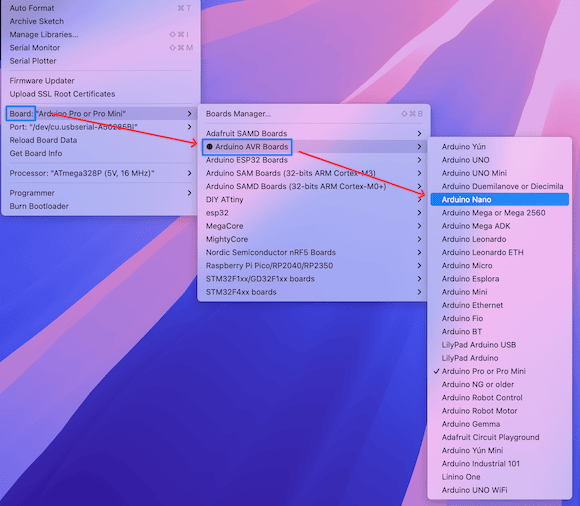
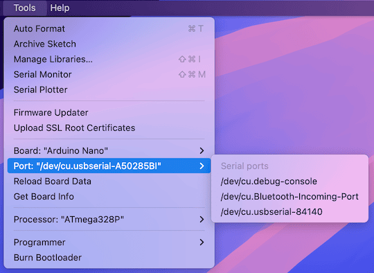

# Arduino Practice

Installation, Configuration, and Make it Blink

---

## Install CH340 Driver

We use Arduino Nano clone board that uses CH340.

1. Be sure to install CH340 driver if you haven't already.
2. For Mac users, you may need to allow the driver in "System Preferences" -> "Security & Privacy".

Ask LLM if you need help installing CH340 driver for your OS.

---

## Install Arduino IDE

1. make sure you have installed the Arduino IDE from [arduino.cc](https://www.arduino.cc/en/software)

- Don't use "Arduino App Labs" that is for UNO Q.
- Use the latest 2.X version, don't use legacy 1.8.X version.

2. connect your Arduino board to your computer via USB cable.

---

## Configure Arduino IDE

The next step is to configure the Arduino IDE for your board.

1. Choose the Nano board from the "Tools" -> "Board" menu.
   

---

2. Check the port from the "Tools" -> "Port" menu.

- The USB port should show up when the board is connected.
- If you don't see the port, try reconnecting the board or reinstalling the CH340 driver.

  

---

### The Magic behind this Setup

When we install IDE, and choose the board and port, the IDE sets up the environment (hardware & software) to compile and upload code to the board automatically.

- Most board makers (including ESP32) support Arduino IDE, so you can use the same IDE to program different boards by just changing the board and port settings.

---

### Open Example Sketch

In Arduino, a program is called a "sketch".

- Open the Blink example sketch from "File" -> "Examples" -> "01.Basics" -> "Blink".
- Click the check button to compile the sketch.
- Click the right arrow button (Upload) to compile and upload the sketch to your board.

---

- The IDE will compile, link, convert to HEX, and upload the sketch to your board automatically.

---

### Debugging with your brain

```txt
Using port            : /dev/cu.usbserial-A50285BI
Using programmer      : arduino
Setting baud rate     : 115200
OS error: cannot open port /dev/cu.usbserial-A50285BI: No such file or directory
Error: unable to open port /dev/cu.usbserial-A50285BI for programmer arduino
```

What if you see this error message? What does it say?

---

It simply means the port you selected is not available.

- In other words, the board is not connected to that port.
- Try reconnecting the board, and make sure to select the correct port from the "Tools" -> "Port" menu.

---

Now, Arduino IDE uses the correct port, and the upload is successful.

```txt
Using port : /dev/cu.usbserial-84140
Using programmer : arduino
Setting baud rate : 115200
AVR part : ATmega328P
Programming modes : SPM, ISP, HVPP, debugWIRE
Programmer type : Arduino
Description : Arduino bootloader using STK500 v1 protocol
HW Version : 3
FW Version : 4.4

AVR device initialized and ready to accept instructions
Device signature = 1E 95 0F (ATmega328P, ATA6614Q, LGT8F328P)
Reading 924 bytes for flash from input file Blink.ino.hex
in 1 section [0, 0x39b]: 8 pages and 100 pad bytes
Writing 924 bytes to flash
Writing | ################################################## | 100% 0.19s
924 bytes of flash written
Avrdude done. Thank you.
```

---

### Debugging using LLM

However, in many cases, especially for beginners, it may not be easy to understand the error messages.

- Use LLM to help you debug the error messages.

```txt
This is my error message when I upload the sketch to Arduino IDE. What's wrong?

OS error: cannot open port /dev/cu.usbserial-A50285BI: No such file or directory
Error: unable to open port /dev/cu.usbserial-A50285BI for programmer arduino
```

- What does your LLM say?

---

In my case (Chat GPT), it correctly identified the problem and suggested solutions.

- Even it shows how to get the correct information on Mac terminal.

```rash
mini23:~ smcho$ ls /dev/cu.*
/dev/cu.Bluetooth-Incoming-Port /dev/cu.usbserial-84140
/dev/cu.debug-console
```

- It shows that the correct port is `/dev/cu.usbserial-84140`, not `/dev/cu.usbserial-A50285BI`.

---

### Use LLM Wisely

- Try to use your brain first to understand the error messages.
- When you learn the tricks to solve the problems with LLM, record it with your 2nd brain.
- When you face the same problem again, try to remember the solution you learned before, instead of asking LLM again.

---

## The Nano Board Bootloader

- It receives the Intel HEX from your PC/Mac via USB.
- It programs the HEX to the flash memory of ATmega328P microcontroller.
- It runs the code from the flash memory.

Now, you can see the built-in LED on the board blinking every second.

---

## The C Programming

This is the Blink sketch code.

```c
// the setup function runs once
// when you press reset or power the board
void setup() {
  // initialize digital pin LED_BUILTIN as an output.
  pinMode(LED_BUILTIN, OUTPUT);
}

// the loop function runs over and over again forever
void loop() {
  digitalWrite(LED_BUILTIN, HIGH);  // turn the LED on (HIGH is the voltage level)
  delay(1000);                      // wait for a second
  digitalWrite(LED_BUILTIN, LOW);   // turn the LED off by making the voltage LOW
  delay(1000);                      // wait for a second
}
```

---

- Notice that the code is written in C/C++ language, and it uses built-in functions provided by the Arduino library (e.g., `pinMode()`, `digitalWrite()`, `delay()`, etc.).
- Many I/O ports are already symbolically defined in the Arduino library (e.g., `LED_BUILTIN` is defined as the pin number for the built-in LED).

---

### Using LLM for Coding Help

- You can use LLM to help you write Arduino sketches in C/C++.
- Arduino programming is nothing more than using C/C++ language with built-in functions and constants provided by the Arduino library.
- You can ask LLM to write code snippets for you, as long as you understand the output code, it's OK.

---

### Using LLM wisely

- Your job as a software engineer is to solve problems using Arudino.
- As long as you understand the code generated by LLM, it's OK to use it.
- Even better, you can use LLM to learn C/C++ programming along with Arduino programming.
- However, when you find your LLM without understanding what you are doing, it is a very dangerous signal.
