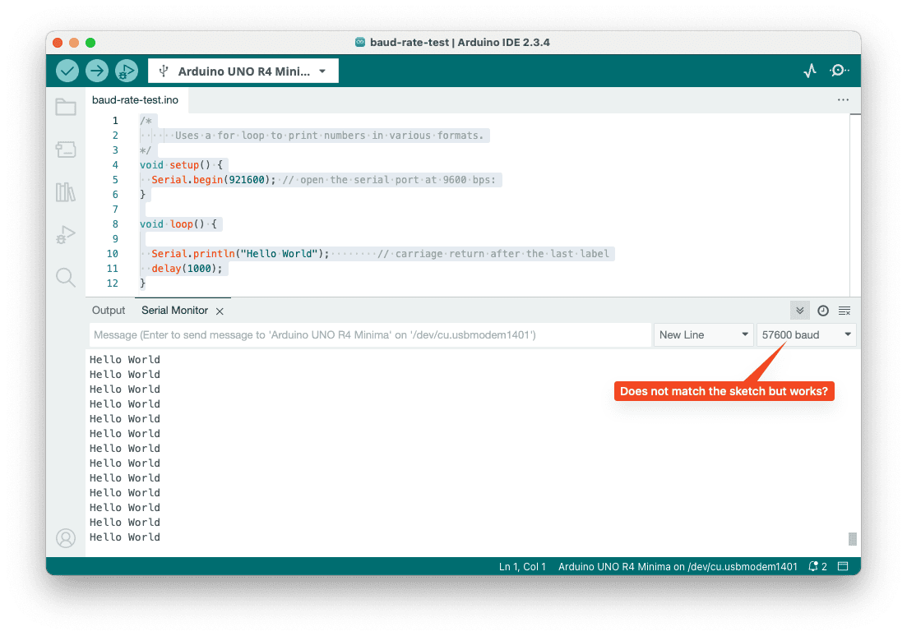
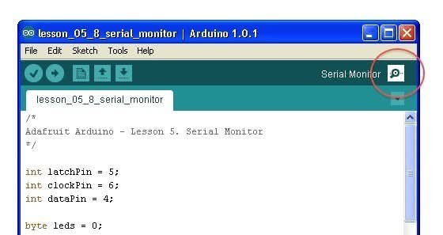
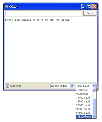

# Arduino Programming

---

## Arduino vs. Traditional Programming

<style scoped>
table {
  font-size: 18pt !important;
}
table thead tr {
  background-color: #aad8e6;
}
</style>

| Traditional Programming | Arduino Programming             |
| ----------------------- | ------------------------------- |
| `print("Hello World")`  | `Serial.println("Hello World")` |
| Infinite loops are bugs | `loop()` function runs forever  |
| Variables in DRAM       | Variables in limited SRAM       |
| File I/O operations     | Pin I/O operations              |
| Network sockets         | Serial/WiFi communication       |
| Threads/processes       | Interrupts and timers           |

> **Key Insight**: Arduino programming is **event-driven** and **resource-constrained** - like programming for embedded systems.

---

### Embedded Programming vs Desktop/Server Programming

- Desktop/Server: Abundant resources, multi-threading, file systems, complex OS features.
- It has giga bytes of DRAM
- It has mega bytes of SRAM (Static RAM) for caches meories.

---

- Embedded/Arduino: Limited memory, single-threaded, no file system, no OS, direct hardware access.
  - It has kilo bytes of SRAM (Static RAM) for variables and stack.
  - Some microcontrollers can execute code from external flash memory, but it is much slower than executing from internal flash.

---

## Arduino Programming Structure

**Every Arduino Program has Two Functions**:

```cpp
void setup() {
    // Runs ONCE when Arduino starts
    // Like a constructor or initialization function
    Serial.begin(9600);
    pinMode(13, OUTPUT);
}

void loop() {
    // Runs FOREVER in a cycle
    // Like an infinite while loop
    digitalWrite(13, HIGH);
    delay(1000);
    digitalWrite(13, LOW);
    delay(1000);
}
```

---

> **Software Engineering Analogy**:
>
> - `setup()` = **Constructor/Initialization**
> - `loop()` = **Main event loop** (like game engines or GUI frameworks)

---

## Digital I/O: On and Off Interface

```cpp
const int BUTTON_PIN = 2;
const int LED_PIN = 13;

void setup() {
    pinMode(BUTTON_PIN, INPUT_PULLUP);
    pinMode(LED_PIN, OUTPUT);
    Serial.begin(9600);
}

void loop() {
    bool isPressed = !digitalRead(BUTTON_PIN);  // Inverted due to pull-up

    digitalWrite(LED_PIN, isPressed);

    Serial.print("Button: ");
    Serial.println(isPressed ? "PRESSED" : "RELEASED");

    delay(100);  // Debouncing delay
}
```

---

## Analog I/O: The Continuous Interface

### **ADC (Analog-to-Digital Conversion)**:

> **Analogy**: ADC is like **sampling continuous music into digital audio** - it converts smooth analog signals into discrete digital values.

---

```cpp
// Reading analog values (0-1023 representing 0V-5V)
int sensorValue = analogRead(A0);

// Convert to voltage
float voltage = sensorValue * (5.0 / 1023.0);

// Convert to meaningful units
float temperature = (voltage - 0.5) * 100.0;  // For TMP36 sensor
```

---

### **PWM (Pulse Width Modulation)**:

> **Analogy**: PWM is like **rapidly blinking a light** - by controlling the on/off ratio, you can control the average brightness.

```cpp
// PWM pins on Uno: 3, 5, 6, 9, 10, 11
analogWrite(9, 128);  // 50% duty cycle (128/255)
analogWrite(9, 64);   // 25% duty cycle (64/255)
analogWrite(9, 255);  // 100% duty cycle (always on)
```

---

## Advanced Programming Concepts

### **Object-Oriented Arduino Programming**:

```cpp
class LED {
private:
    int pin;
    bool state;
    unsigned long lastToggleTime;
    unsigned long blinkInterval;
```

---

```cpp
public:
    LED(int pinNumber) : pin(pinNumber), state(false),
        lastToggleTime(0), blinkInterval(1000) {
        pinMode(pin, OUTPUT);
    }

    void on() {
        state = true; digitalWrite(pin, HIGH);
    }

    void off() {
        state = false; digitalWrite(pin, LOW);
    }

    void toggle() {
        state = !state; digitalWrite(pin, state);
    }

    void setBlinkInterval(unsigned long interval) {
        blinkInterval = interval;
    }

    void update() {  // Call this in loop()
        unsigned long currentTime = millis();
        if (currentTime - lastToggleTime >= blinkInterval) {
            toggle();
            lastToggleTime = currentTime;
        }
    }
};
```

---

- The C++ code is similar to Java with minor details.
- For example, C++ need to use the `new` operator when it creates an object on the stack.

```cpp
// Usage
LED statusLED(13);
LED warningLED(12);

void setup() {
    statusLED.setBlinkInterval(500);   // Fast blink
    warningLED.setBlinkInterval(2000); // Slow blink
}

void loop() {
    statusLED.update();
    warningLED.update();
}
```

---

## Timer and Interrupt Programming

### **Non-blocking Code with millis()**:

> **Problem**: `delay()` blocks everything - like using `Thread.sleep()` in the main thread!

```cpp
// BAD: Blocking approach
void loop() {
    digitalWrite(13, HIGH);
    delay(1000);              // Everything stops here!
    digitalWrite(13, LOW);
    delay(1000);              // And here!
}
```

---

```cpp
// GOOD: Non-blocking approach
unsigned long previousMillis = 0;
const long interval = 1000;
bool ledState = false;

void loop() {
    unsigned long currentMillis = millis();

    if (currentMillis - previousMillis >= interval) {
        previousMillis = currentMillis;
        ledState = !ledState;
        digitalWrite(13, ledState);
    }

    // Other code can run here without being blocked!
    checkSensors();
    handleCommunication();
    updateDisplay();
}
```

---

## Arduino Libraries: The Package Ecosystem

**Example Essential Libraries**

```cpp
// Servo control
#include <Servo.h>
Servo myServo;

// LCD display
#include <LiquidCrystal.h>
LiquidCrystal lcd(12, 11, 5, 4, 3, 2);
```

---

```cpp
// WiFi connectivity
#include <WiFi.h>
WiFiClient client;

// JSON parsing
#include <ArduinoJson.h>
DynamicJsonDocument doc(1024);

// Software serial (additional UART)
#include <SoftwareSerial.h>
SoftwareSerial mySerial(10, 11);
```

---

### Good news!

- Most sensors and modules have existing Arduino libraries, so you don't have to write low-level code to interface with them.
- Also, most libraries come with example sketches that you can use as a starting point for your projects.
- This is one of the reasons why Arduino is so popular for prototyping and learning embedded programming.

---

### **Creating Custom Libraries**:

```cpp
// MyLibrary.h
#ifndef MyLibrary_h
#define MyLibrary_h

#include "Arduino.h"

class TemperatureSensor {
public:
    TemperatureSensor(int pin);
    float readCelsius();
    float readFahrenheit();
private:
    int _pin;
};

#endif
```

---

```cpp
// MyLibrary.cpp
#include "MyLibrary.h"

TemperatureSensor::TemperatureSensor(int pin) {
    _pin = pin;
}

float TemperatureSensor::readCelsius() {
    int reading = analogRead(_pin);
    float voltage = reading * 5.0 / 1024.0;
    return (voltage - 0.5) * 100.0;
}

float TemperatureSensor::readFahrenheit() {
    return readCelsius() * 9.0 / 5.0 + 32.0;
}
```

---

## Communicating with PC/Mac

**Serial Communication**

> **Analogy**: Serial communication is like **sending messages one character at a time** over a telephone line.

---

- Make sure to set the same baud rate in both Arduino and Serial Monitor (e.g., 9600 bps).



---

- You can use the serial monitor to see the output from your Arduino and also to send commands from your PC/Mac to the Arduino.



---

```cpp
void setup() {
    Serial.begin(9600);  // Baud rate: bits per second
}

void loop() {
    // Sending data
    Serial.println("Hello Computer!");
    Serial.print("Sensor value: ");
    Serial.println(analogRead(A0));

    // Receiving data
    if (Serial.available() > 0) {
        String command = Serial.readString();
        command.trim();  // Remove whitespace

        if (command == "LED_ON") {
            digitalWrite(13, HIGH);
            Serial.println("LED turned ON");
        } else if (command == "LED_OFF") {
            digitalWrite(13, LOW);
            Serial.println("LED turned OFF");
        }
    }

    delay(1000);
}
```
