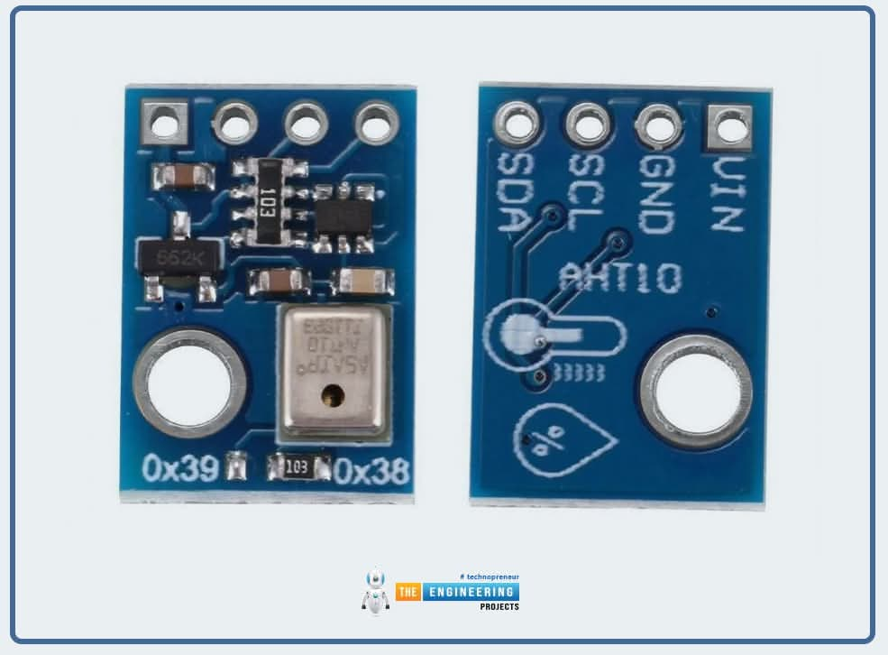
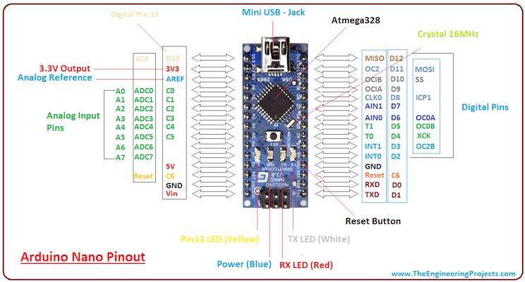
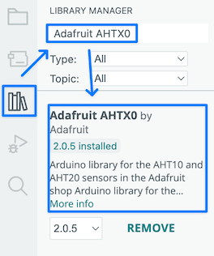
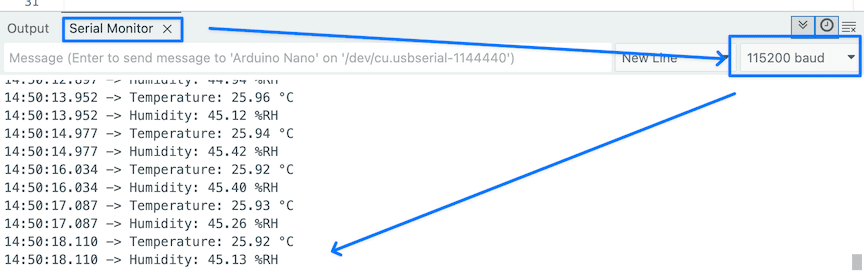

# Arduino + AHT10 using I2C

---

## AHT10

- Use LLM to understand AHT 10.

"What is AHT10 and how to use it?"

When it returns too much information, be specific.

"What is AHT10? Give me an example to read sensor data when I use Arduino."

---

### The information about AHT10 (From LLM)

- Measures temperature and relative humidity using an internal calibrated sensor and outputs the data digitally over I²C.
- Uses a fixed I²C address (0x38) and only needs VCC, GND, SDA and SCL connections.
- Typical operating voltage is compatible with 3.3 V and 5 V Arduino boards, so you can power it directly from the board.

---

I get all the information to use the sensor.

- temperature + relative humidity
- already calibrated
- I2C (0x38)
- 3.3V & 5V

---

### Wiring to an Arduino Uno (From LLM)

- VCC → 5V (or 3.3V if your breakout recommends it).
- GND → GND.
- SDA → A4 (SDA on Arduino Uno).
- SCL → A5 (SCL on Arduino Uno).

---


The last pin (SDA) connects to A4 & SDL connects to A5.


---

### Example using Adafruit AHTX0 library (From LLM)

This is a simple sketch that reads temperature and humidity using the Adafruit AHTX0 (AHT10/AHT20) library.

1. Install libraries (Arduino IDE):

- Sketch → Include Library → Manage Libraries…
- Install “Adafruit AHTX0” and “Adafruit Unified Sensor”.

---

Arduino IDE has the "Library Manager" to add variety of library code to the application: install the library.



---

## Code Analysis

We can ask any part of the code to LLM.

```cpp
# include <Wire.h>
# include <Adafruit_AHTX0.h>

Adafruit_AHTX0 aht;

void setup() {
  Serial.begin(115200);
  Serial.println("AHT10/AHT20 demo");

if (!aht.begin()) {
  Serial.println("Could not find AHT10, check wiring!");
  while (1) delay(10);
}
  Serial.println("AHT10 found");
}
```

---

### Wire.h discussion with LLM

I discussed with LLM and find out that Wire.h is necessary because of I2C.

- However, we don't use I2C directly, instead, we use the following code to get the information.
- The code that uses Wire.h is hidden.
- So, we can delete the code "include <Wire.h>".

```cpp
  sensors_event_t humidity, temp;
  aht.getEvent(&humidity, &temp); // read sensor
```

---

This discussion shows that we should understand what the LLM is generating.

- Otherwise, we can make mistakes.
- We cannot catch the mistakes that LLMs make.

---

### Adafruit_AHTX0 object

We use C++ object Adafruit_AHTX0.

- Unlike Java, we can instantiate objects in a stack (Discuss with LLM about this if you don't understand the idea).
- In most embedded systems, we don't use heap; so this is OK.

```cpp
# include <Adafruit_AHTX0.h>

Adafruit_AHTX0 aht;
```

---

```cpp
void loop() {
  sensors_event_t humidity, temp;
  aht.getEvent(&humidity, &temp); // read sensor

  Serial.print("Temperature: ");
  Serial.print(temp.temperature);
  Serial.println(" °C");

  Serial.print("Humidity: ");
  Serial.print(humidity.relative_humidity);
  Serial.println(" %RH");

  delay(1000);
}
```

---

### Use LLM to understand all the details of code

- LLMs already help us to identify "known unknowns" from "unknown unknowns" through code generation.
- We should use LLMs for known unknowns to "known knonws".
- In doing so, we should learn, not just copy and paste.
- Having the 2nd brain helps to facilitate this process.

---

### Compile -> Error

When I compile the sketch, I have an error.

- Copy the error message to LLM.
- Get the answer from the LLM.
- It shows root cause & quick fix.

```txt
Quick fix: Install dependencies
 1. Open Sketch → Include Library → Manage Libraries.
 2. Search and install (in order):
 • Adafruit BusIO (provides SPIDevice.h and Register.h).
 • Adafruit Unified Sensor (dependency for events).
```

---

### LLM as the Debugger

- Read the error message and think about the possible cause.
- If it is too big or complicated, copy the error message to get the fixes.
- If necessary, use multiple LLMs.

---

### Upload the Code

Run the serial monitor (Tools -> Serial Monitor).

- Make sure the baud of the serial monitor matches the code setup.

```cpp
void setup() {
  Serial.begin(115200);
```



---

## Magic -> Machine

Always start from Magic.

- Make it work first.
- Discuss the code with LLM to understand the details.

Then, understand the mechanisms of how things work.

- C++/C programming
- I2C communication
