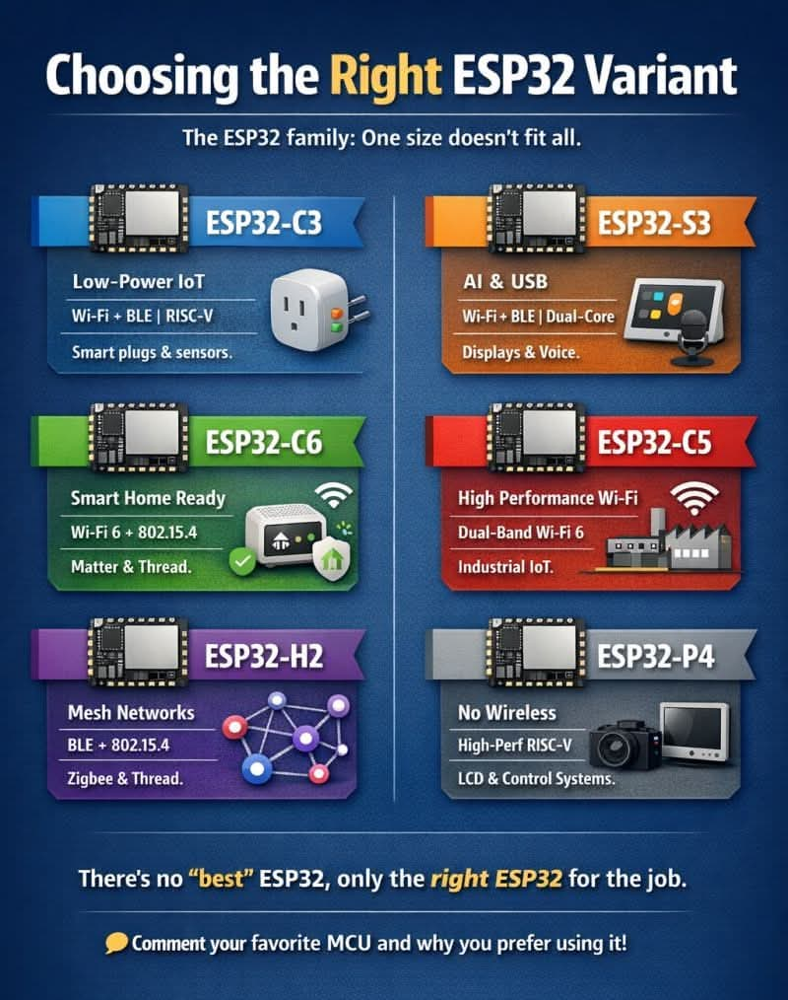
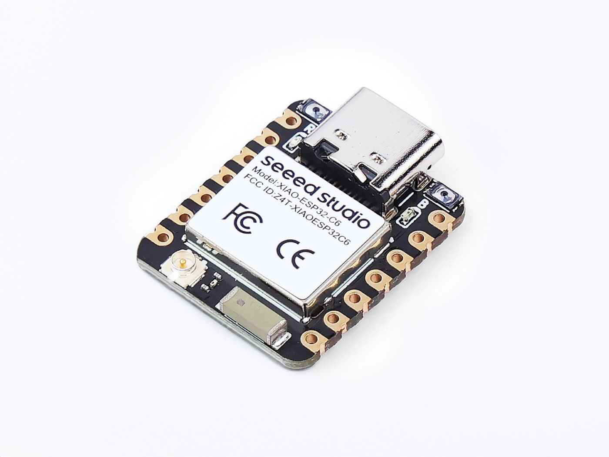
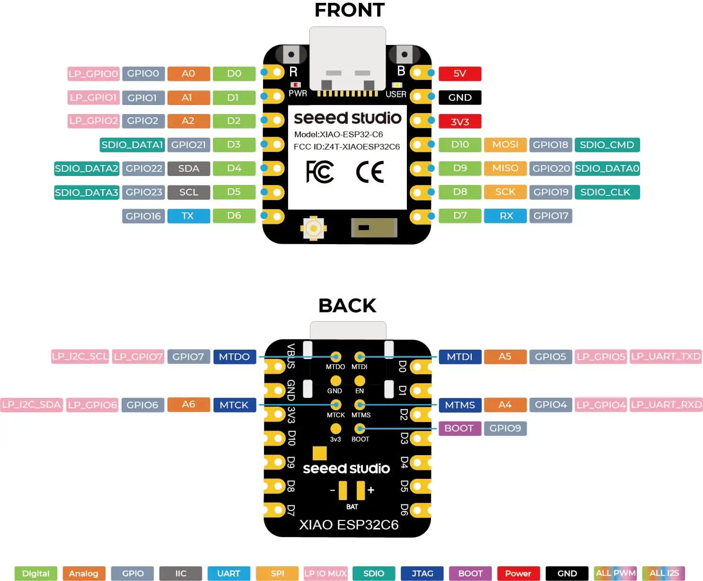
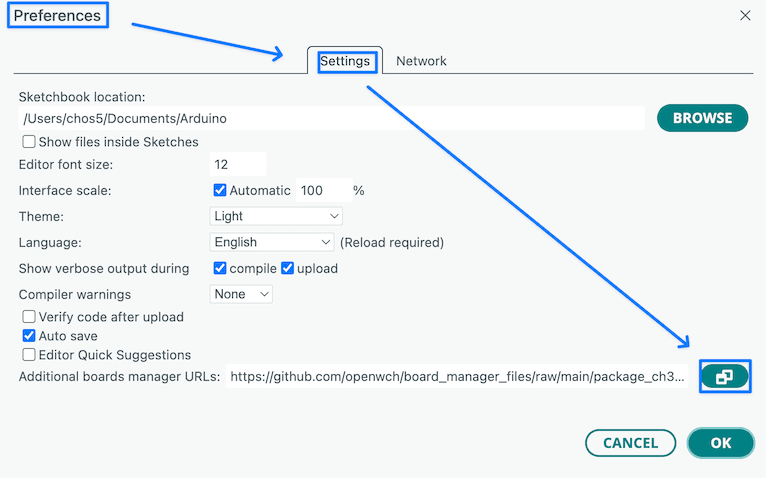
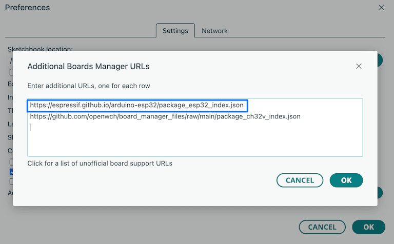
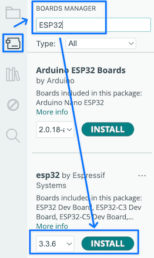
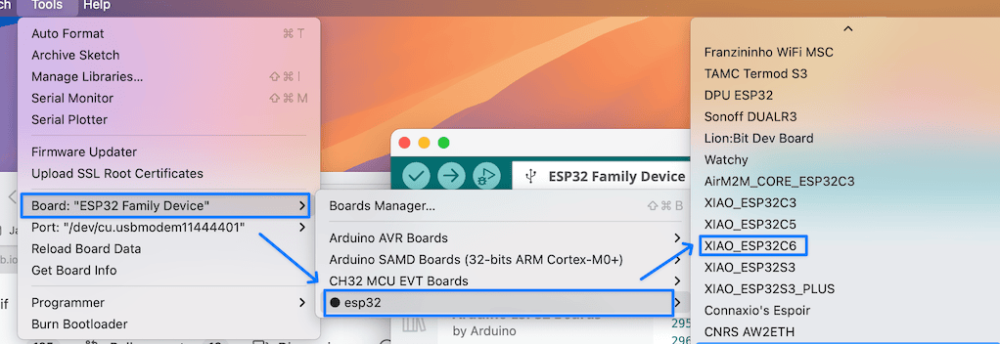
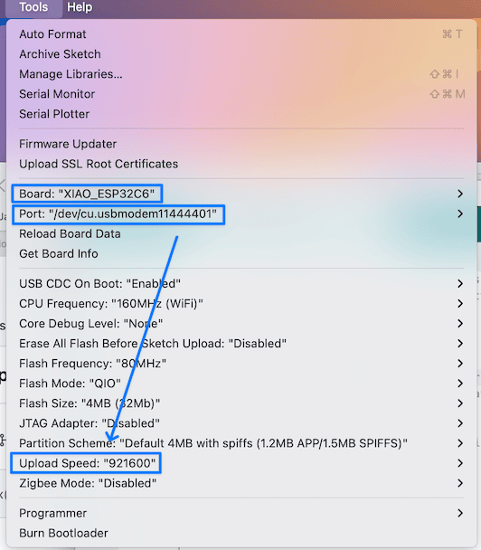
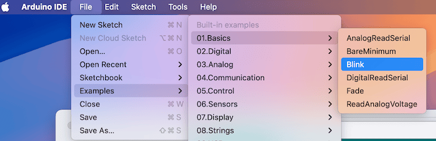
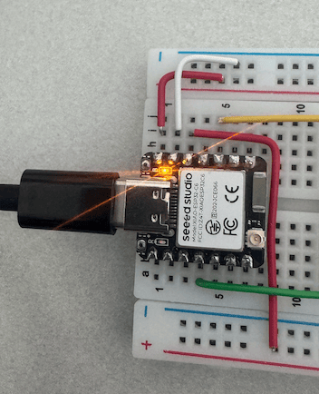

# Topic 2: ESP32

The Cost-Effective Internet of Things (IoT) Platform

---

## Questions

- What makes a product successful?
  - What makes Japanese cars successful in the US market?
  - Then, what makes ESP32 successful?

---

My answer is: **Cost-Effective**.

- It's not about the best quality or the most features, but about the best value for the price.
- Even though Japanese cars may not be the best in terms of performance, they offer a good balance of quality and affordability.
- Similarly, ESP32 may not be the most powerful or feature-rich microcontroller, but it is good enough for most IoT applications.

---

### What is the problem that ESP32 solves?

- Before ESP32, we had to choose between expensive microcontrollers with WiFi capabilities or cheap ones without WiFi.
- ESP32 provides a cost-effective solution by integrating WiFi and Bluetooth capabilities into a single chip, making it accessible to a wide range of developers and hobbyists.

---

### How does ESP32 achieve cost-effectiveness?

- Mass production and widespread adoption have driven down the cost of ESP32 chips.
- The success of its predecessor, ESP8266, paved the way for ESP32's popularity and affordability.
- Then, ESP32 improves by offering more features and better performance while maintaining a low price point.

---

### The Software Ecosystem

- ESP32 supports ESP-IDF, the official development framework, which provides a comprehensive set of tools and libraries for programming ESP32.
- However, many developers prefer using the Arduino IDE for ESP32 programming due to its simplicity and large community support.

---

## The ESP32 Variants

- There are many variants of ESP32 boards available in the market, each with different features and specifications.
- For example, ESP32C6 is a low-cost and focus on Home automation with Zigbee support, while ESP32-S3 is a high-performance variant with AI capabilities.

---

---

## Using ESP32C6

  

  

  

We are using Seeed Studio XIAO ESP32C6 for our project, which is a compact and cost-effective board with Zigbee support, making it ideal for home automation applications.
  

---

XIAO ESP32C6 has limited number of external I/Os, so pins have duplicate functions.

---

## Using Arudion IDE for ESP32 Programming

- We need to teach Arudion IDE the JSON information about the board <https://espressif.github.io/arduino-esp32/package_esp32_index.json>

Use this page to learn how to add ESP32 support to Arduino IDE:
<https://wiki.seeedstudio.com/xiao_esp32c6_getting_started/>

---

### Board Manager

Preference -> Settings -> Board Manager

---

Add <https://espressif.github.io/arduino-esp32/package_esp32_index.json> to the board manager.

---

Open Board Manager and install "esp32 by Espressif".

<https://github.com/espressif/arduino-esp32?tab=readme-ov-file#supported-chips>

---

From the Board menu, select esp32 -> XIAO ESP32C6.

---

Check the board, port, and baud rate.

---

### Run the Blink Example

Make sure the Arduion IDE compiles, links, and uploads the binary (HEX) to the ESP32 board.

---

### Test Other Examples

There are many ESP32C6 examples that you can use:

1. ESP32C6 as the web server.

- Any IoT device can access ESP32C6 to get information.

---

2. ESP32C6 as the web client that accesses the web server.

- We need a web server that ESP32C6 should send the information to.
- ESP32C6 accesses the web server to send the information.

Choose the example for your project start testing it.
