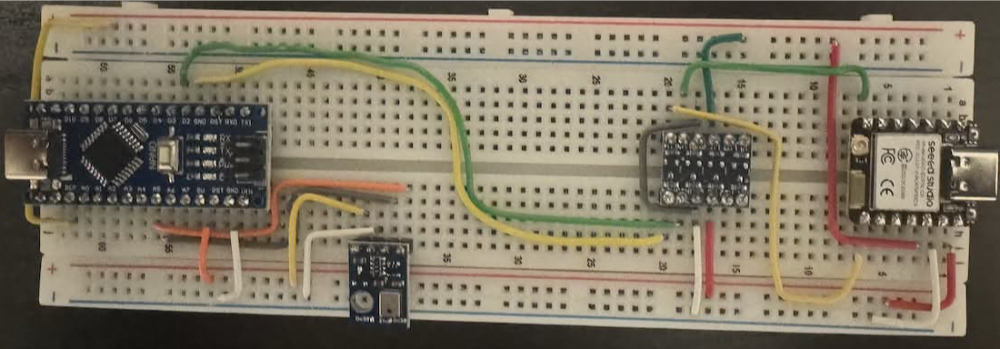
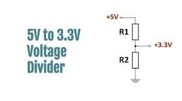
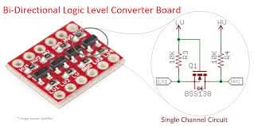
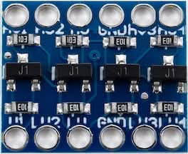
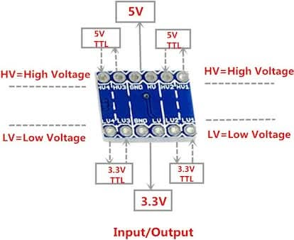

# Two Board Setup

Arduino Nano + ESP32C

---

We need two boards for our project: Arduino Nano for sensing and ESP32 for communication.

- To connect two boards, we need to use a level shifter to convert the voltage levels between the two devices.

---

## We focus on problem solving, not on learning new tools

- We use two chips solution: Arduino nano for sensing and ESP32 for communication.
- It is possible to use ESP32 for both sensing and communication, but we choose to use Arduino nano for sensing because it is more cost-effective and easier to program for simple sensor tasks.

---

### Divide and Conquer Problem Solving

- It can reduce the debugging time, as we can focus on the communication aspect with ESP32 while using Arduino nano for sensing.
- We apply software design rule: SRP (Single Responsibility Principle) to separate the concerns of sensing and communication, making our code more modular and easier to maintain.

---

## The Connection between Arduino Nano and ESP32

- Arduino Nano (old technology) uses 5.0V logic level, while ESP32 (new technology) uses 3.3V logic level.

- To connect them, we need to use a level shifter to convert the voltage levels between the two devices.

---

### Voltage Divider as the 1st Option

If the goal is to simply send data from Arduino Nano to ESP32, we can use a voltage divider circuit instead of a level shifter.

Ask LLM why this is a problem.

---

### Level Shifter

Due to the limitations of voltage dividers, we will use a level shifter for our project.

- It's not expensive and can handle multiple channels, making it more suitable for our needs.
- We don't want to debug circuit issues that can be caused by voltage dividers.

---

There is already a dedicated chip (TXS0102) for level shifting, which can handle multiple channels and is more reliable than a voltage divider.

---

## Problem Solving

- We are problem solvers, not tool learners.
- We use the tools that are best suited for our needs, rather than trying to use a single tool for everything.
- LLMs are great help to build the circuit for solving our problems, but we should make the decision out of multiple choices.
- Instead of believing the LLM answers, we need to think and make our decisions based on our understanding of the problem and the tools available.

---

## Think about them (Discuss with LLM)

We have software choices: ESP-IDF and Arudino IDE for ESP32 programming.

- Why do we need to use arduino IDE for ESP32 programming?
  - Why not use ESP-IDF directly?
  - What are the pros and cons of using arduino IDE?

---

We have hardware choices: Many ESP32 variants and Arudino variants.

- Why there are so many variants of ESP32 boards?
  - What are the differences between them?
  - Which one should we use for our project?

---

We have communication choices: Server based, client based, MQTT, HTTP, etc.

- How can we use ESP32 as a IoT platform?
  - Can it send data to the internet?
  - Can it function as a web server, client, or a router?
  - Can it function as a standalone microcontroller with WiFi capability?
  - Howa about using MQTT for communication between devices?

---

### We should make the decisions

- AI based XYZ means that out of many choices, we choose the one that is best suited for our needs, and we use AI to help us make that decision.
- To make the correct decision, we should understand the core ideas of XYZ, and the problem-solution patterns.
- AI will help us to learn and apply the solution.
- However, we should not blindly follow the AI's suggestions, but rather use our own judgment and understanding to make the final decision.

---

### Recommendation

1. Give your answers first; there are no good or bad answers.

- Answering them will stimulate your brain.

2. Get an answer from one LLM.
3. Ask more questions to the same or different LLMs.

4. Organize your thoughts to the 2nd brain system.
