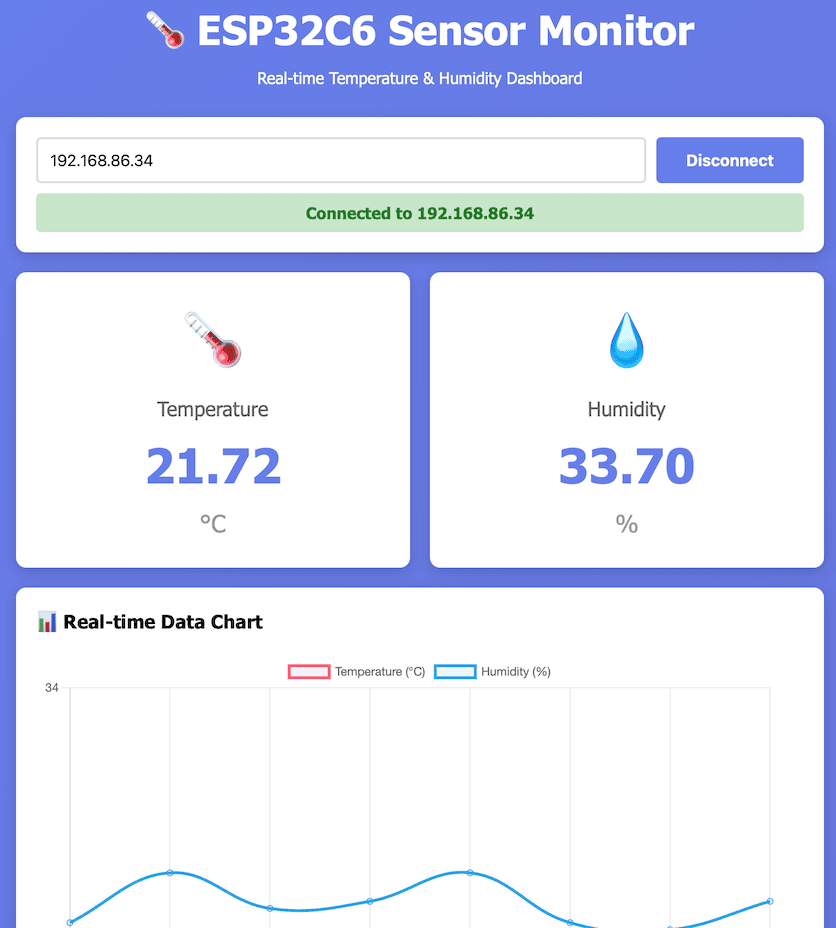

# Two Board Setup (Code Analysis)

---

## Ardunino Nano

### Wiring Information

```cpp
/**
 * Arduino Nano - AHT10 Sensor Reader (SoftwareSerial Version)
 *
 * Uses SoftwareSerial to avoid conflict with USB Serial (D0/D1)                 .
 * Reads temperature and humidity from AHT10 sensor
 * and sends data to ESP32C6 via Software Serial pins D2/D3
 *
 * Hardware Connections:
 * AHT10:
 *   VCC -> 5V
 *   GND -> GND
 *   SDA -> A4
 *   SCL -> A5
 *
 * To ESP32C6 (via Level Shifter):
 *   D2 (SW TX) -> Level Shifter HV1 -> LV1 -> ESP32C6 RX (GPIO17)
 *   D3 (SW RX) -> Level Shifter HV2 -> LV2 -> ESP32C6 TX (GPIO16)
 *   5V -> Level Shifter HV
 *   GND -> Level Shifter GND (and ESP32C6 GND)
 *
 * IMPORTANT: D0/D1 are now FREE for USB communication!
 */
```

---

We use SoftwareSerial to avoid conflict with USB Serial (D0/D1) and to allow simultaneous debugging via Serial Monitor.

```cpp
# include <Adafruit_AHTX0.h>
# include <SoftwareSerial.h>

// Software Serial pins for ESP32C6 communication
// D2 = TX (to ESP32C6 RX)
// D3 = RX (from ESP32C6 TX)
SoftwareSerial esp32Serial(3, 2); // RX, TX

Adafruit_AHTX0 aht;

```

---

### Setup

We use Serial for debugging and SoftwareSerial for communication with ESP32C6.

```cpp
void setup() {
  // Hardware Serial for USB debugging (can use Serial Monitor!)
  Serial.begin(9600);
  // Software Serial for ESP32C6 communication
  esp32Serial.begin(9600);

  // Initialize AHT10 sensor
  Serial.print("Initializing AHT10 sensor... ");
  if (!aht.begin()) {
      Serial.println("ERROR:AHT10_NOT_FOUND");
      while (1) { delay(1000); }
  }
  Serial.println("OK!");

  // Wait for sensor to stabilize
  delay(100);
  Serial.println("Starting data transmission...");
}
```

---

### Loop

It keeps reading the sensor data and sends it to ESP32C6 every 2 seconds.

- Notice that the "TEMP:" and "HUMID" prefixes are used to identify the type of data being sent to ESP32C6.

```cpp
void loop() {
  // Read sensor data
  sensors_event_t humidity, temp;
  aht.getEvent(&humidity, &temp);

  // Format data string
  String dataString = "TEMP:";
  dataString += String(temp.temperature, 2);
  dataString += ",HUMID:";
  dataString += String(humidity.relative_humidity, 2);                             .

  // Send to ESP32C6 via SoftwareSerial
  esp32Serial.println(dataString);
```

---

Also print to USB Serial Monitor for debugging

```cpp
  Serial.print("Sent to ESP32C6: ");                                     .
  Serial.println(dataString);
  Serial.print(" Temperature: ");
  Serial.print(temp.temperature, 2);
  Serial.println(" °C");
  Serial.print(" Humidity: ");
  Serial.print(humidity.relative_humidity, 2);
  Serial.println(" %");
  Serial.println("-------------------");

  // Send data every 2 seconds
  delay(2000);
}
```

---

## ESP32C6

In this example, ESP32C6 is a web server that:

- It receives data from Arduino Nano via SoftwareSerial (D2/D3).
- It serves a web page that displays the latest sensor data.

---

### Hardware Connections

```cpp

#include <WiFi.h>
#include <WebServer.h>

// WiFi credentials
const char* ssid = "YOUR_WIFI_SSID";
const char* password = "YOUR_WIFI_PASSWORD";

// Web server on port 80
WebServer server(80);

// Serial pins for ESP32C6
#define RXD2 17  // Connect to Arduino TX via level shifter
#define TXD2 16  // Connect to Arduino RX via level shifter
```

---

### setup()

- When it is connected to PC/Mac through USB, it uses it for debugging.
- It uses SoftwareSerial (D2/D3) to receive data from Arduino Nano.

```cpp
void setup() {
  // Serial for debugging
  Serial.begin(115200);

  // Serial for Arduino communication
  Serial1.begin(9600, SERIAL_8N1, RXD2, TXD2);

  Serial.println("\nESP32C6 Sensor Web Server");                         .
  Serial.println("=========================");
```

---

- It connects to the Wifi network and prints the IP address.

```cpp
  // Connect to WiFi
  WiFi.begin(ssid, password);
  Serial.print("Connecting to WiFi");

  while (WiFi.status() != WL_CONNECTED) {                                .
    delay(500);
    Serial.print(".");
  }
```

---

- Based on the request URL, it serves different content:
  - "/" serves the main HTML page.
  - "/data" serves the latest sensor data in plain text.
  - "/api/sensor" serves the latest sensor data in JSON format.

```cpp
Serial.println("\nWiFi connected!");                                         .
Serial.print("IP address: ");
Serial.println(WiFi.localIP());

// Setup web server routes
server.on("/data", handleData);

server.begin();
Serial.println("HTTP server started");
```

---

### loop()

- It reads the data from Arduino Nano via SoftwareSerial and updates the latest sensor values.

```cpp
void loop() {
  // Handle web server requests
  server.handleClient();

  // Read data from Arduino
  if (Serial1.available()) {
    String data = Serial1.readStringUntil('\n');
    data.trim();

    Serial.println("Received: " + data);

    // Parse data: TEMP:23.45,HUMID:55.32
    if (data.startsWith("TEMP:")) {
      parseData(data);
      dataValid = true;
      lastUpdate = getTimeString();
    } else if (data.startsWith("ERROR:")) {
      dataValid = false;
      lastUpdate = data;
    }
  }
}
```

---

### JSON API Endpoint

- When requested from the web browser, it serves the latest sensor data in JSON format.

```cpp
// JSON data endpoint
void handleData() {
  String json = "{";
  json += "\"temperature\":" + String(temperature, 2) + ",";
  json += "\"humidity\":" + String(humidity, 2) + ",";
  json += "\"valid\":" + String(dataValid ? "true" : "false") + ",";
  json += "\"lastUpdate\":\"" + lastUpdate + "\"";
  json += "}";

  server.send(200, "application/json", json);
}
```

---

## HTML Web Page

### How to get the IP address of ESP32C6?

From the code, you can see that after connecting to WiFi, it prints the IP address to the Serial Monitor:

```cpp
  Serial.println("\nWiFi connected!");                             .
  Serial.print("IP address: ");
  Serial.println(WiFi.localIP());
```

```txt
9:22:52.567 -> Connecting to WiFi.............................
19:23:03.172 -> WiFi connected!
19:23:03.172 -> IP address: 192.168.86.34
```

---

### Use Web Browser to Access the Web Page

<http://192.168.86.34/data>

Returns the JSON data with the latest sensor values:

```json
{
  "temperature":21.83,
  "humidity":33.65,
  "valid":true,
  "lastUpdate":"00:01:01 ago"                            .
}
```

---

### Web Page + JavaScript

This JavaScript code fetches the latest sensor data from the ESP32C6 web server and updates the display on the web page.

```js
async function fetchData() {
  if (!esp32IP) return;

  try {
    const response = await fetch(`http://${esp32IP}/data`);
    if (!response.ok) throw new Error("Network response was not ok");

    const data = await response.json();
    updateDisplay(data);
    updateChart(data);
  } catch (error) {
    console.error("Fetch error:", error);
    throw error;
  }
}
```

---

### Error when using the web page

When I access the ESP32C6 from the web page, I get the following error in the browser console:

```txt
Connection failed: Load failed
```

---

### LLM Answer

It shows that the error is from CORS policy. The browser is blocking the request to `http://<IP_ADDRESS>/data` because the server is not sending the appropriate CORS headers.

However, the fixed code seems like a non sense.

```cpp
...
#define DHTPIN 4
#define DHTTYPE DHT22
DHT dht(DHTPIN, DHTTYPE);
...
```

---

I didn't understand why do I need the DHT code, so I specifically asked about it.

Then, LLM answers that it's a mistake!

I had to add one line of code, not tens of absurd code lines.

```cpp
void handleData() {
  server.sendHeader("Access-Control-Allow-Origin", "*");  // 이 줄만 추가!

  String json = "{\"temperature\":";
  json += random(15, 30);
  json += ",\"humidity\":";
  json += random(40, 80);
  json += "}";
  server.send(200, "application/json", json);
}
```

---



---

### Recommendation

- LLM can be helpful for debugging and providing suggestions, but it may not always give the most efficient or correct solution.
- Always review the suggestions critically and consider the context of your project before implementing them.
- Use multiple LLMs or consult with human experts if you're unsure about a particular suggestion.
