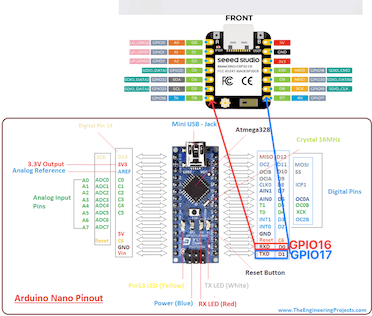

# Two Board Setup (Practice)

Ardunio Nano, ESP32C6, and Web Application Programming

---

## The Prompt

We don't need to build the code from scratch. However, we should give detailed instructions to the LLM to get the code that we need. We should also understand the code that we get from the LLM, and be able to modify it if needed.

```txt
Instead of using serial (USB) port, I connect nano board to ESP32C6.

Show me how to connect between the two boards:

1. I use 5.5V 3V level shifter to connect them.
   Make code for:
1. Arduino nano code
1. ESP32C6 code that works as the server.
1. Web application code that access the ESP32C6 server.
```

---

In this prompt, we don't ask for the code; instead, we specify the conditions (connecting nana to ES32C6) with detailed instructions (using level shifter) and the requirements (code for nano, ESP32C6 server, and web application).

- We need to understand what we are asking for.
- We should be able to make (even though it is not perfect) code for each part of the system, and understand how they work together.
- We cannot solve problems when we just copy and paste LLM generated code without fully understanding it.

---

## First Solution (from LLM)

```cpp
/**
 * AHT10:
 *   VCC -> 5V
 *   GND -> GND
 *   SDA -> A4
 *   SCL -> A5
 *
 * To ESP32C6 (via Level Shifter):
 *   TX (D1) -> Level Shifter HV1 -> LV1 -> ESP32C6 RX (GPIO17)
 *   RX (D0) -> Level Shifter HV2 -> LV2 -> ESP32C6 TX (GPIO16)           .
 */

#include <Adafruit_AHTX0.h>

Adafruit_AHTX0 aht;

void setup() {
  // Serial for ESP32C6 communication
  Serial.begin(9600);

  // Initialize AHT10 sensor
  if (!aht.begin()) {
    // Send error message to ESP32C6
    Serial.println("ERROR:AHT10_NOT_FOUND");
    ...
```

---

### The ESP32 Code

```cpp
/**
 *
 * Hardware Connections (via Level Shifter):
 *   RX (GPIO17) <- LV1 <- HV1 <- Arduino TX (D1)
 *   TX (GPIO16) -> LV2 -> HV2 -> Arduino RX (D0)
 *   3.3V -> Level Shifter LV
 *   GND -> Level Shifter GND
 */

#include <WiFi.h>
#include <WebServer.h>

// WiFi credentials
const char* ssid = "YOUR_WIFI_SSID";
const char* password = "YOUR_WIFI_PASSWORD";

// Web server on port 80
WebServer server(80);

// Serial pins for ESP32C6
#define RXD2 17  // Connect to Arduino TX via level shifter
#define TXD2 16  // Connect to Arduino RX via level shifter

// Sensor data variables
float temperature = 0.0;
float humidity = 0.0;
String lastUpdate = "No data yet";
bool dataValid = false;

void setup() {
  // Serial for debugging
  Serial.begin(115200);
  ...
}
```

---

### The Web Application Code

```html
<!DOCTYPE html>
<html lang="en">
<head>
    <meta charset="UTF-8">
    <meta name="viewport" content="width=device-width, initial-scale=1.0">
    <title>ESP32C6 Sensor Monitor</title>
    <style>
<!DOCTYPE html>
<html lang="en">
<head>
    <meta charset="UTF-8">
    <meta name="viewport" content="width=device-width, initial-scale=1.0">
    <title>ESP32C6 Sensor Monitor</title>
    <style>
...

        function updateChart(data) {
            if (!chart) return;

            const now = new Date().toLocaleTimeString();
            chartData.labels.push(now);
            chartData.temperature.push(data.temperature);
            chartData.humidity.push(data.humidity);

```

---

### Something seems to be wrong with the code

This Arduino code seems to be OK, but we can see that it's strange.

- The code is basically the same as before.
- It uses the same Serial object that was used for USB communication, but now it is used for communication with ESP32C6.

I don't understand if it's OK or not.

---

When I tried to connect the wires, it is also starnge that I use the serial ports (RS-232) that I use for USB communication to my Mac/PC.



---

### Discussion with LLM

LLM answers my question:

- It is OK because the Serial object can use the same pins for USB communication and ESP32C6 communication.
- When it doesn't use USB communication, it can use the same pins for ESP32C6 communication.

```txt
Nano TX ── 1k ──┬── ESP RX
                │
               2k
                │
               GND
```

---

### Discussion with Other LLM

- But, I'm not convinced that it is always OK.
- So, I ask another LLM when it is not OK.

---

It shows the possible issues with using the same Serial object for both USB and ESP32C6 communication.

```txt
If ESP32 sends data during flashing:
 • Nano bootloader gets noise
 • Upload fails

Fix: unplug RX/TX while uploading.

Use Serial for ESP32 comms.

Trade-off:
 • Must unplug for upload
 • Limited debugging
```

---

It even shows the possible solution to the problem.

```cpp
#include <SoftwareSerial.h>

SoftwareSerial espSerial(4, 5); // RX, TX

void setup() {
  Serial.begin(115200);     // USB debug
  espSerial.begin(9600);    // ESP32 link
}
```

---

### Use LLM wisely

It's not that the first LLM is worse than the second LLM; it's just that we asked the questions differently.

- First LLM: "Is it OK to use the same Serial object for both USB and ESP32C6 communication?"
- Second LLM: "What are the possible issues with using the same Serial object for both USB and ESP32C6 communication?"

---

### Recommendation

1. Use Mutliple LLMs to get different perspectives on the problem.
2. Ask different questions to get different answers.
3. Ask questions from different perspectives.
4. Keep asking until you are finially convinced that you have the right answer.
