# Circuits (Passive)

Understanding the Building Blocks of Digital Systems

---

## What is a Circuit?

**Circuit** = A closed loop that allows electrical current to flow

> **Analogy**: Think of a circuit like a **water pipe system**
>
> - **Voltage** = Water pressure (pushing force)
> - **Current** = Water flow rate (amount flowing)
> - **Resistance** = Pipe width (how much it restricts flow)

```txt
[Battery] ──► [Wire] ──► [Component] ──► [Wire] ──► [Back to Battery]
    ▲                                                    │
    └────────────────── Complete Loop ──────────────────┘
```

---

## Ohm's Law: The Golden Rule

### V = I × R

- **V** = Voltage (Volts) - the "pressure"
- **I** = Current (Amperes) - the "flow"
- **R** = Resistance (Ohms) - the "restriction"

**Real Example**: LED with 5V supply needs 20mA current

- LED forward voltage (the voltage drop): 2V
- Resistor needed: (5V - 2V) / 0.02A = 150Ω

---

### Current

This example shows that we can control the current using a resiter:

- When a pipe is narrow (high resistance), less water flows (low current)
- When a pipe is wide (low resistance), more water flows (high current)

---

In most cases, voltage is fixed (like a water pump), and we use resistors to control the current (like adjusting pipe width).

- Outlet voltage is 110V AC
- USB voltage is 5V DC
- Batteries can be 1.5V, 9V, etc.

---

## Current -> Power Consumption

Power (Watts) = Voltage (Volts) × Current (Amperes)
Power (Watts) = I² × R

This means that if we increase current, power consumption increases significantly (quadratically with current).

- This is why controlling current is crucial for energy efficiency and safety.

---

### Energy = Power × Time

When we talk about batteries, we often use mAh (milliampere-hours) to indicate how long a battery can supply a certain current.

- A 1000mAh battery can supply 1000mA for 1 hour, or 500mA for 2 hours, etc.
- Voltage is fixed, so using mAh, we can easily calculate energy in watt-hours (Wh) = (mAh × Voltage) / 1000

---

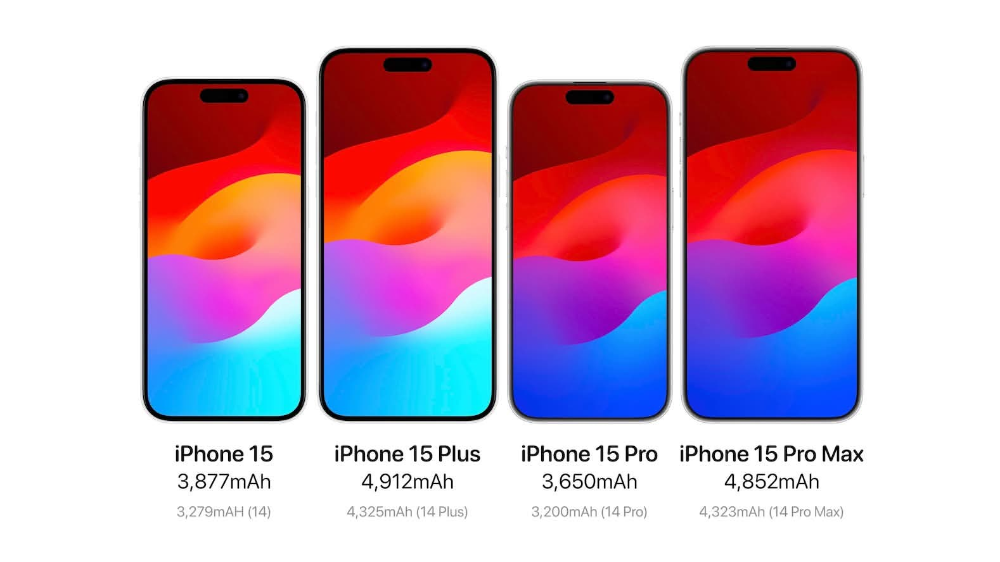

---

## Think

P = V x I = I² x R
V = I x R

We can understand the impact of the USB-C cables.

---

### Think: Why buying high quality USB cables is important?

Cheap cables often have thin wires (high resistance), which can lead to:

- Remember V = I x R

---

1. When resistance is high, the voltage drop across the cable increases, meaning less voltage reaches your device.
2. This can cause slower charging or even damage to the device if it tries to draw more current to compensate.
3. High resistance can also lead to overheating of the cable, which is a safety hazard.

- Remember Power (Energy / time) = I² × R

---

### Think: Why USB-C cables can charge faster than older USB cables?

USB-C cables are designed to handle higher voltages (up to 20V) and currents (up to 5A) compared to older USB standards (up to 5V and 3A).

- Remember Power = Voltage × Current
- Higher Voltage means more power can be delivered to the device, allowing for faster charging.
- Higher Curren means also more power.

---

### Think: Pulling more power

Modern devices (such as iPhone or Mac) that uses USB-C can vary the voltage and current to pull more power from the charger, which is why they can charge faster than older devices that use USB-A.

- Also, this is why we should use USB-C chargers and cables that are rated for higher power delivery to ensure safe and efficient charging.

---

### Think: When pulling the same power

A device pulls the same power (e.g., 5W), how does the voltage impact the current?

- At 5V, the current would be 1A (Power = Voltage × Current → 5W = 5V × 1A)
- At 20V, the current would be 0.25A (Power = Voltage × Current → 5W = 20V × 0.25A)

In other words, higher voltage means lower current for the same power.

---

### Why does this matter?

1. **Efficiency**: Higher voltage with lower current reduces energy loss in the cable (I²R losses).
2. **Safety**: Lower current reduces the risk of overheating and fire hazards.

That's the reason why most countries use 220V: the exceptions are US and Japan (110V) and some others.

---

## Two Main Categories:

1. **Passive Components**
   - Don't amplify or generate power
   - Like _data structures_ in programming - they store or organize

2. **Active Components**
   - Can amplify signals or control current
   - Like _functions_ in programming - they process and transform

---

## Passive Components

- Resistors
- Capacitors
- Inductors

---

### 1. Resistors: The Speed Bumps

> **Analogy**: Resistors are like **speed bumps** on a road - they slow down the flow of electricity.

What they do:

- Limit current flow (I = V / R)
- Drop voltage (V = I × R)
- Convert electrical energy to heat (P = I² × R)

---

Common Uses:

- LED current limiting
  - without a registor, an LED can draw too much current and burn out
- Voltage dividers
  - We could use two resistors to create a specific voltage from a higher voltage source
- Pull-up/pull-down resistors in digital circuits

```txt
Arduino Code Example:
pinMode(2, INPUT_PULLUP);  // Internal pull-up resistor
```

---

Reading Resistor Values:

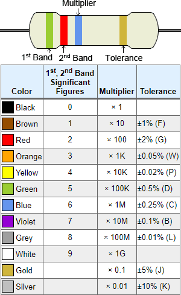

---

**Example**: Brown-Red-Brown = 1-2-×10 = 120Ω

> **Memory Trick**: "**B**oys **R**ace **O**ur **Y**oung **G**irls"

Or, just use a tester to measure the resistance directly!

---

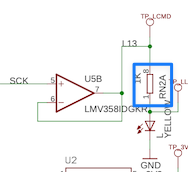

In this circuit, to turn on the LED, we should attach a 1K resistor in series to limit the current.

- Large resistor -> small current -> dim LED
- Small resistor -> large current -> bright LED

---

### 2. Capacitors: The Temporary Batteries

> **Analogy**: Capacitors are like **rechargeable water tanks** - they store electrical energy and release it when needed.

What they do:

- Store electrical charge
- Smooth out voltage fluctuations
- Block DC, allow AC to pass

---

Types:

- **Ceramic**: Small values, filtering
- **Electrolytic**: Large values, power supplies
- **Tantalum**: Stable, compact

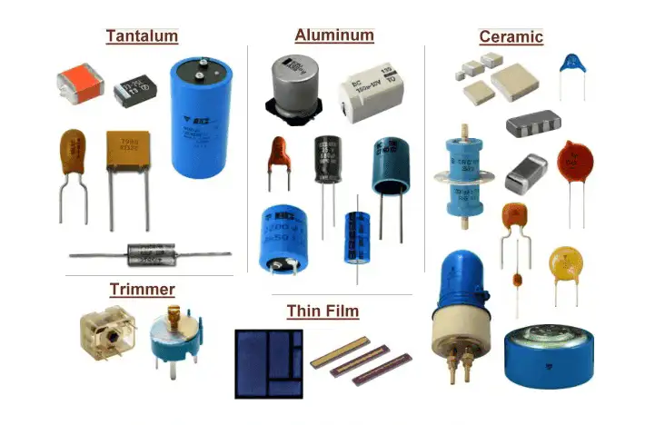

---

Real Examples:

- **Power supply filtering** (smooth DC voltage)
- **Coupling/decoupling/bypass** in amplifiers
- **Oscillators** in clocks and radios

---

### Power supply filtering

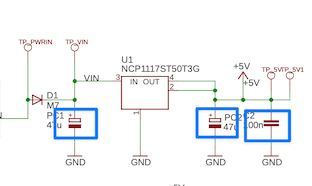

1. Capacitors smooth out the voltage, ensuring a stable supply to the circuit.
2. When the voltage drops, the capacitor can release stored energy to maintain the voltage for a short time.

---

### Coupling/decoupling/bypass in amplifiers

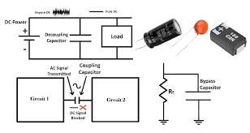

Capacitors are used to remove unwanted input, such as noise or DC offset, while allowing the desired AC signal to pass through.

---

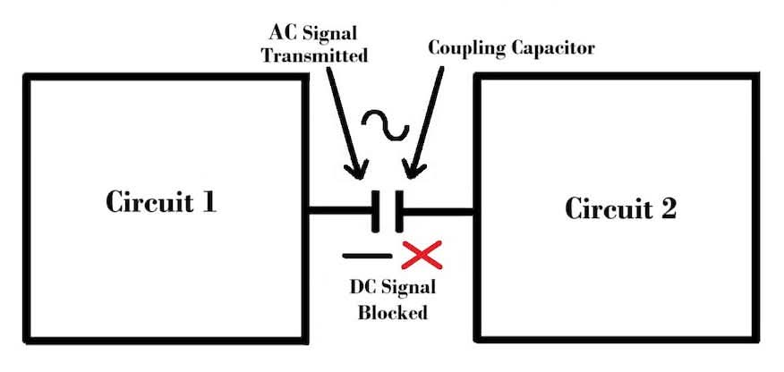

1. Coupling capacitors block DC components while allowing AC signals to pass between stages of an amplifier.
2. In other words, it couples the AC signal from one stage to the next while decoupling the DC biasing.

---

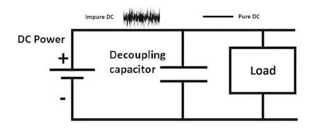

1. Decoupling capacitors decopule noises from the power supply, providing a clean voltage to sensitive components.
2. In other words, it decopules the AC noise from the DC power supply, ensuring stable operation of the circuit.

---

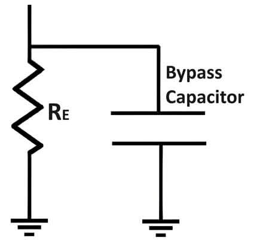

1. Bypass capacitors provide a low-impedance path to ground for high-frequency noise, improving the stability of the circuit.
2. In other words, it bypasses the high-frequency noise to ground, preventing it from affecting the operation of the circuit.

---

### Oscillators

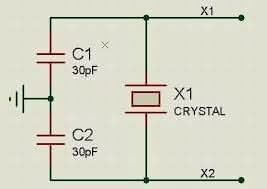

1. Capacitors and inductors can create oscillations by storing and releasing energy in a cycle, which is the basis for clocks and radio signals.
2. Arduino uses a crystal osciallator to make clock signal for timing.

---

## 3. Inductors: The Momentum Keepers

> **Analogy**: Inductors are like **flywheels** in mechanical systems - they resist changes in current and store energy in magnetic fields.

Capacitors: Water Tanks -> resist changes in voltage
Inductors: Flywheels -> resist changes in current

---

### What they do:

- Store energy in magnetic fields
  - Current -> Magnetic field -> Energy storage
  - (Comparison) Voltage -> Electric field -> Energy storage in capacitors
- Resist changes in current
  - (Comparison) Resistors resist current flow, but inductors resist changes in current
  - (Comparison) Capacitors resist changes in voltage

---

It's just a magnetic coil:

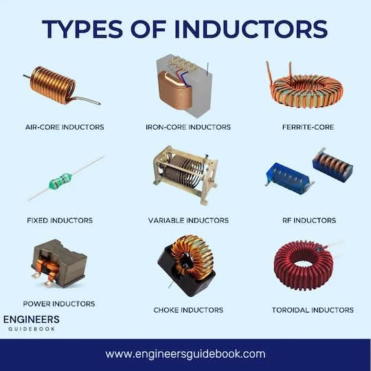

- Block AC, allow DC to pass (opposite of capacitors!)

---

### Applications:

- **Switching power supplies**
  - Inductors are used in buck/boost converters to store and transfer energy efficiently.
  - Energy is stored in the magnetic field when the switch is on, and released to the load when the switch is off to make higher voltage.

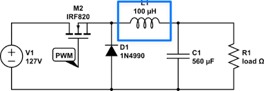

---

**RF circuits** (antennas, filters)

- Inductors (and capacitors) can be used to create resonant circuits that select specific frequencies, which is essential in radio communication.
- Sometimes, antennas themselves can be considered as inductive elements that interact with electromagnetic waves.

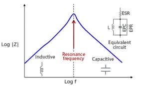

---

**Motors and transformers**

- Motors are purely inductive loads, and transformers use inductors to transfer energy between circuits through magnetic coupling.
- This is why capacitors should be attached in parallel to motors to reduce voltage spikes caused by the inductive load when switching.

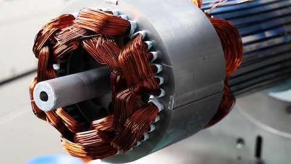

---

**Impedence**

We know resistance (R) is the opposition to current flow in DC circuits.

- AC circuits, we also have reactance (X) from capacitors and inductors.
- The combination of resistance and reactance is called impedance (Z), which determines how much current flows for a given voltage in AC circuits.

Z = √(R² + X²)

---

**Impedance Matching**

In RF circuits, we often need to match the impedance of the source and load to maximize power transfer and minimize reflections.

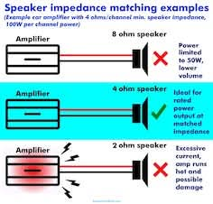
