# Circuits (Active)

Understanding the Building Blocks of Digital Systems

---

## Active Components

- Diode
- Transistor
- Operational Amplifier (Op-Amp)
- Voltage Regulators

---

Passive components: resistance (R) and reactance (X) -> impedance (Z = R + jX) are constant (only frequency dependent).

Active components: resistance are changing based on voltage or current

---

## 1. Diodes: The One-Way Valves

> **Analogy**: Diodes are like **one-way valves** in plumbing - current can only flow in one direction.

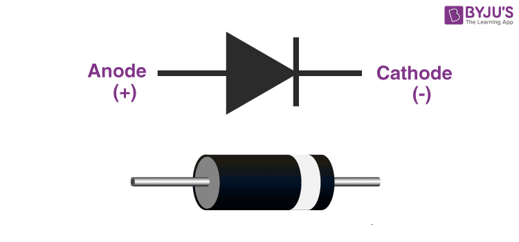

---

- Positive direction: R is low (forward bias)
- Negative direction: R is high (reverse bias)

Active components change their resistance.

- Diodes change their resistance based on the direction of current flow.

---

- **Standard Diodes**: Rectification (AC to DC)

Using 4 diodes in a bridge configuration to convert AC to DC:

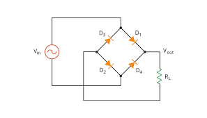

---

We add capacitors to smooth the output:

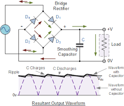

---

**LEDs**: Light emission + current limiting

```arduino
// Simple LED control
void setup() {
    pinMode(13, OUTPUT);
}
void loop() {
    digitalWrite(13, HIGH);  // LED on
    delay(1000);
    digitalWrite(13, LOW);   // LED off
    delay(1000);
}
```

In Arduino, the built-in LED on pin 13 is connected in series with a resistor, so it can be safely turned on and off without needing an external resistor.

---

## 2. Transistors: The Electronic Switches

> **Analogy**: Transistors are like **smart water faucets** controlled by a small handle - a tiny input signal controls a much larger output flow.

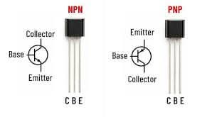

---

Trans + Resistor = Transistor

- Resistance changes based on input
- If input is high, resistance is low → current flows
- If input is low, resistance is high → current stops

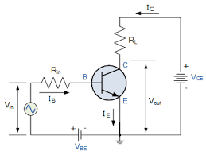

---

Tansistor is simply merging two diodes together.

- When input (current) is given to the base, the trans resistance between collector and emitter changes, allowing a larger current to flow through.
- When input is removed, the resistance becomes high, stopping the current flow.

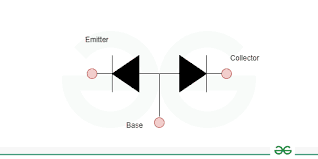

---

**Two Functions**:

Analog: Amplify a small signal into a larger one (like a microphone to speaker) by changing resistance based on input.

Digital: Act as a switch to turn on/off current flow (like a light switch) by changing resistance from high to low.

---

### Two Main Types: Current vs Voltage

- BJT (Bipolar Junction Transistor)
- FET (Field-Effect Transistor)

---

**BJT (Bipolar Junction Transistor)**

- **Base**: Control input (like faucet handle)
- **Collector**: Main input (water source)
- **Emitter**: Main output (water flow)

The input is controlled by current (ib) -> output is multiplied by B x ib.

- BJT consumes current (power = $I^2 R$) to drive both input and output.

---

**FET (Field-Effect Transistor)**

- **Gate**: Control input (voltage-controlled)
- **Drain**: Main input
- **Source**: Main output

FET was invented to get the same effect but using voltage.

- FET consumes no current in the input. The output current is multiplied from the input voltage.

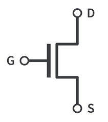

---

### Usage of BJT & FET

BJT - Mainly for Analog (Amplification)
FET - Mainly for Digital (Switch)

Analog audio amps use BJT based transistors.

- Notice the Capacitor at the input and output to remove the DC component.

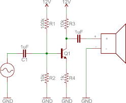

---

Sony invented the first transistor radio.

- We need only 8 transistor to amplify the radio signal to audible sound.
- We need resistors to flow currents.
- We need capacitors to filter out noise and DC components.

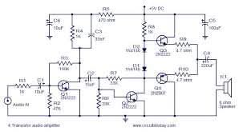

---

FET is used to make all the digital components: memory & logic in VLSI (Very Large Scale Integration).

- DRAM requires 1 FET + 1 capacitor for 1 bit (1T1C)
- SRAM (Cache) requires 6 FET for 1 bit (6T)

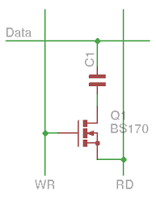

---

Any digital system can be decomposed into components that are made with FET transistors.

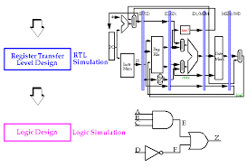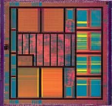

---

## 3. Operational Amplifiers (Op-Amps)

> **Analogy**: Op-amps are like **super-smart assistants** that can amplify, compare, or perform mathematical operations on signals.

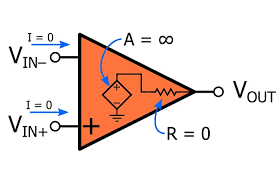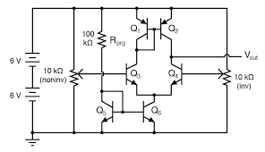

---

### Why do we need OP-Amps?

Transistors circuits are hard to use.

- We need a simpler way to amplify and manipulate signals.
- With OP-Amps these (and much more) analog functions are easily implemented:

1. Adder - Adding two signals
2. Comparator - Compare two signals
3. Amplifier - Increase the strength of a signal
4. Integrator - Integration of functions.

---

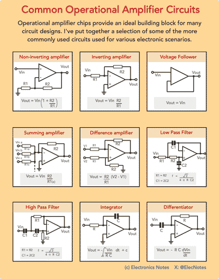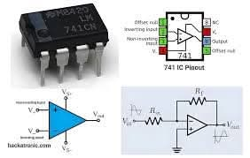

---

### When do you use OP-Amps

In the real-world project, it is not common to use transistors.

- Instead, you will use OP-Amps for using analog singal based sensors.
- There is a variety of OP-Amps that you can choose for your project.

LM741 (classic, general-purpose), TL072 (low-noise JFET, audio), and NE5532 (industry-standard audio)

---

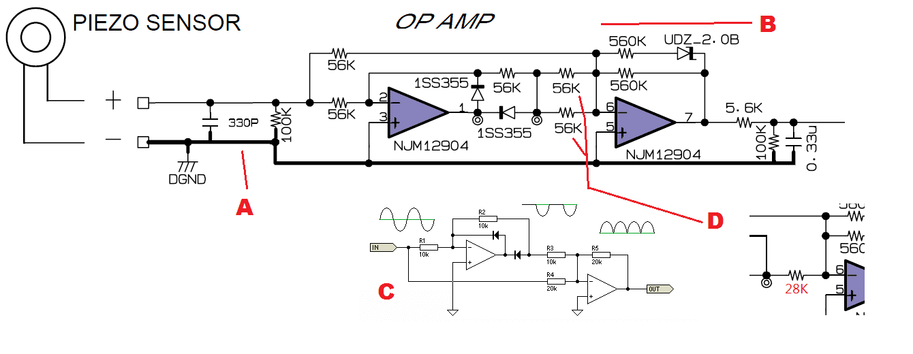

---

## 5. Voltage Regulators

To use digital components, we need a stable power supply.

- Active circuit that maintains constant output voltage
- Takes variable input voltage → produces fixed output voltage
- Most common: 78xx series (positive) and 79xx series (negative)

---

Regulators use OPamps to compare the output voltage with a reference voltage and adjust the current flow to maintain a constant output.

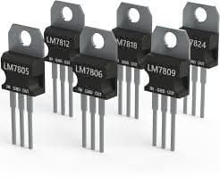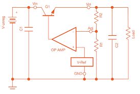

---

### Why do we need voltage regulators?

- Batteries voltage drops as they discharge (9V → 7V)
- Wall adapters can have voltage fluctuations
- Microcontrollers need stable, clean power (Arduino: 5V, ESP32: 3.3V)

---

### 7805: The Classic 5V Regulator

1. We need to give more than 5V (e.g., 9V battery) to the input.
2. We need to add two capacitors to stabilize the output voltage and filter out noise (0.33µF at input, 0.1µF at output).

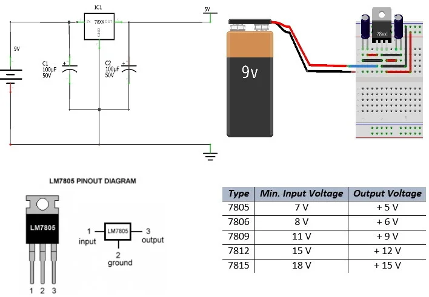
