# I/O, A/D, D/A, and PWM

---

## I/O Pins

Input/Output pins are the basic interface for microcontrollers to interact with the physical world.

- Digital I/O: Read/write binary signals (0 or 1)
- Analog I/O: Read/write continuous signals (e.g., voltage)

---

## Digital I/O

Arduino supports 22 digital input/output pins that can read or write binary signals (0 or 1).

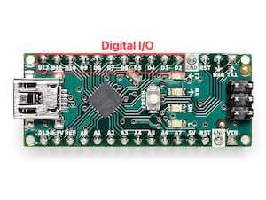

---

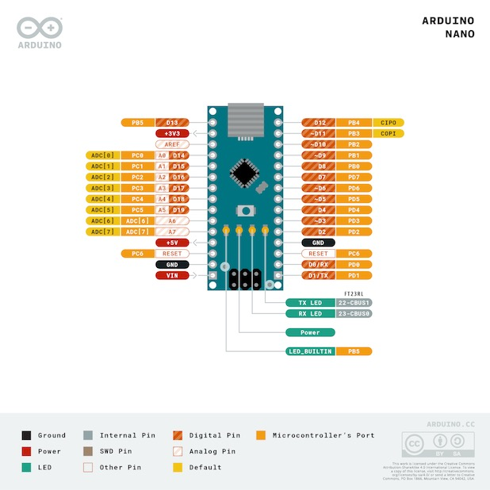

- Many pins are multi-functional and can be used for digital I/O, analog input, or special functions (e.g., I2C, SPI).

---

The digital I/O pins are conceptually simple:

- Two diodes to protect against voltage spikes
- One capacitor for noise filtering
- One resistor for pull-up or pull-down configuration

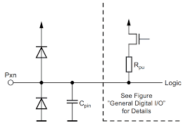

---

The full circuit is basically the same with additional digital logic to read/write the pin state and handle interrupts.

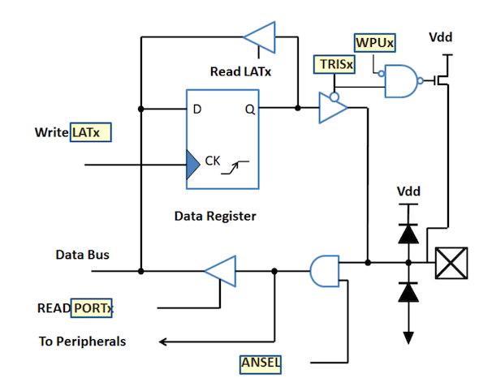

---

## Analog I/O

Arduino Nano features 8 analog input pins (A0–A7) utilizing a 10-bit Analog-to-Digital Converter (ADC), which converts 0 – 5 V inputs into integer values from 0 to 1023.

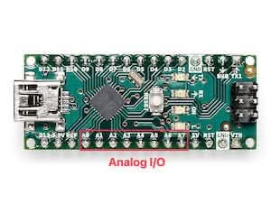

---

## A/D Converter

Sensor information is in most cases analog signals, such as voltage or current.

- To use this information in a digital system, we need to convert it to a digital format.
- We use Analog to Digital Converters (ADC) for this purpose.

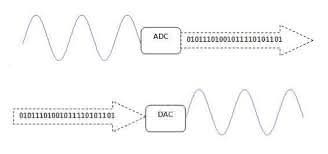

---

### Implementing A/D Converter

We use OP-Amps and resistors (voltage divider) for comparing the input signal to generate 0 or 1, then encode the bits into a digital format.

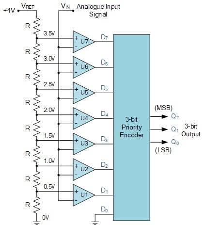

---

## D/A Converter

D/A converters convert digital signals back to analog signals (voltage or current) for controlling analog devices.

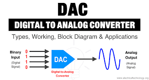

_Warning: Arduino does not have built-in D/A converters!_

---

### Implementing D/A Converter

We use a resistor ladder (R-2R) and adder (OP-Amp) to convert digital bits back to an analog voltage.

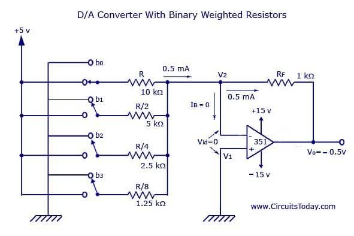

---

### A/D and D/A Board

We can buy A/D and D/A converter modules that integrate all the necessary components for easy use with microcontrollers.

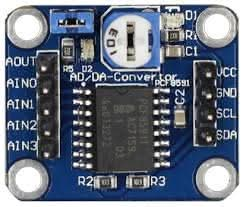

---

## Arduino Nano A/D Converter

Arduino Nano has 8 anaglog input pins, but it has only one A/D converter (10 bit resolution), so it uses a multiplexer to switch between the input pins.

```txt
       ┌─ A0
       ├─ A1
ADC ───┼─ A2
       ├─ A3
       ├─ A4
       ├─ A5
       ├─ A6
       └─ A7
```

---

But it takes time to switch between the pins and perform the conversion.

- Arduino Nano runs 16 MHz
- ADC uses a prescaler (default = 128): 16 MHz / 128 = 125 kHz ADC clock
- ATmega328P ADC requires 13 ADC cycles per conversion: 13 / 125 kHz ≈ 104 µs
- So, one analogRead() takes about: 100 us (0.1 ms) → 10,000 readings per second

---

- There are 8 channels, so if we read all channels sequentially, it takes about 0.8 ms for one full cycle (1250 cycles per second)

Single Channel:

```txt
A0  A0  A0  A0  A0  A0 ...
```

Eight channels:

```txt
A0  A1  A2  A3  A4  A5  A6  A7  A0  A1  A2  A3 ...
```

---

## Pulse Width Modulation (PWM)

Ardunino does not have built-in D/A converters, but it can simulate analog output using PWM (Pulse Width Modulation) on digital pins.

---

### What is PWM?

PWM = Pulse Width Modulation

- A technique to simulate analog signals using digital outputs
- Creates a square wave with varying duty cycle
- Used to control power delivered to devices

**Key Idea:** By changing how long the signal stays HIGH vs LOW, we can control the "average" power output.

---

### Basic Concept (Duty Cycle)

```txt
HIGH  ████████░░░░░░░░  ← 50% Duty Cycle
LOW

HIGH  ████████████░░░░  ← 75% Duty Cycle
LOW

HIGH  ████░░░░░░░░░░░░  ← 25% Duty Cycle
LOW
```

**Duty Cycle = (HIGH time / Total time) × 100%**

---

## PWM Parameters

1. Frequency (Hz)

- How fast the signal repeats
- Usually fixed (e.g., 1kHz, 20kHz)

2. Duty Cycle (%)

- Percentage of time signal is HIGH
- **0%** = Always OFF
- **50%** = Half power
- **100%** = Always ON

---

### Real-World Applications

1. LED Brightness Control

- 0% duty cycle = LED OFF
- 50% duty cycle = Half brightness
- 100% duty cycle = Full brightness

2. Motor Speed Control

- Higher duty cycle = Faster motor
- Lower duty cycle = Slower motor

3. Servo Motor Position

- Duty cycle determines angle (1ms-2ms pulse width)

---

## Arduino PWM Example

Arduino pins 3, 5, 6, 9, 10, and 11 can output PWM signals.

```arduino
int led = 9;
analogWrite(led, brightness);
```

---

### Frequency

PWM frequency = how fast one ON/OFF cycle repeats per second

$f_{PWM} = \frac{f_{clock}}{\text{prescaler} \times \text{timer counts}}$

- Atmega328P clock = 16 MHz
- Default prescaler = 64
- Timer counts = 256 (8-bit timer)
- So, $f_{PWM} = \frac{16,000,000}{64 \times 256} \approx 976.56$ Hz

---

### Resolution (8-bit PWM)

Arduino's PWM has 8-bit resolution (0-255): Think of PWM like a dimmer with 256 brightness steps:

- Step size is small → smoother control
- Larger bit depth → finer control

---

### analogWrite() Function

A call to analogWrite() is on a scale of 0 - 255, such that analogWrite(255) requests a 100% duty cycle (always on), and analogWrite(127) is a 50% duty cycle (on half the time) for example.

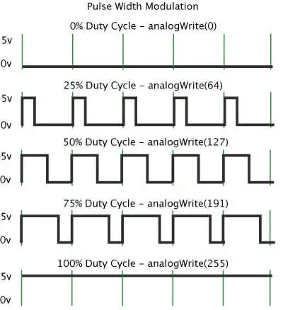

---

```cpp
// Control LED brightness with PWM
int ledPin = 9;     // PWM pin
int brightness = 0; // 0-255 (8-bit PWM)

void setup() {
  pinMode(ledPin, OUTPUT);
}

void loop() {
  // Gradually increase brightness
  for (brightness = 0; brightness <= 255; brightness += 5) {
    analogWrite(ledPin, brightness);  // PWM output
    delay(30);
  }

  // Gradually decrease brightness
  for (brightness = 255; brightness >= 0; brightness -= 5) {
    analogWrite(ledPin, brightness);
    delay(30);
  }
}
```

---

### Change PWM Frequency

Timer1 PWM Prescaler vs Frequency (Arduino Nano / Uno)

| Prescaler | Bits | PWM Frequency     |
| --------- | ---- | ----------------- |
| 1         | 0x01 | ~31.37 kHz        |
| 8         | 0x02 | ~3.92 kHz         |
| 64        | 0x03 | ~490 Hz (default) |
| 256       | 0x04 | ~122 Hz           |
| 1024      | 0x05 | ~30 Hz            |

---

Change D9/D10 frequency (Timer1).

```cpp
// ----------------------------------------
// Set PWM prescaler for Timer1 (D9, D10)
// ----------------------------------------
void setPWMFrequency_T1(uint16_t prescaler) {

  uint8_t modeBits;

  switch (prescaler) {
    case 1:    modeBits = 0x01; break;
    case 8:    modeBits = 0x02; break;
    case 64:   modeBits = 0x03; break;
    case 256:  modeBits = 0x04; break;
    case 1024: modeBits = 0x05; break;
    default:   return; // invalid prescaler
  }

  // Clear last 3 bits, then set new prescaler
  TCCR1B = (TCCR1B & 0b11111000) | modeBits;
}
```

---

## PWM vs. Traditional Control

Without PWM (Analog Control)

- Requires **Digital-to-Analog Converter (DAC)**
- More complex circuitry
- Less efficient (heat dissipation)

With PWM (Digital Control)

- Uses **digital pins** only
- Simple to implement in software
- More efficient (switches fully ON/OFF)
- Better noise immunity

---

### Common PWM Frequencies

| Application    | Typical Frequency  |
| -------------- | ------------------ |
| LED Control    | 100Hz - 20kHz      |
| Motor Control  | 1kHz - 20kHz       |
| Servo Motors   | 50Hz (20ms period) |
| Audio          | 44.1kHz+           |
| Power Supplies | 20kHz - 100kHz     |

**Rule of Thumb:** Higher frequency = smoother control, but more processing overhead
