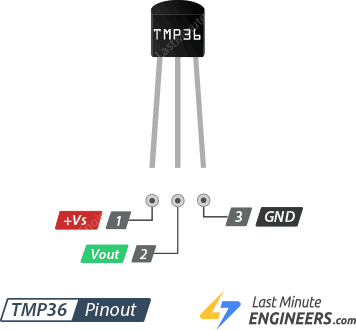
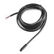
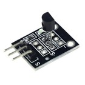
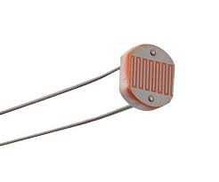
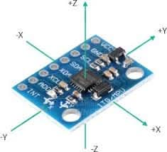
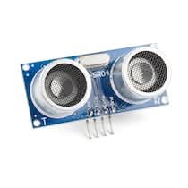

# Sensors

The Input Devices of the Physical World

---

## What Are Sensors?

> **Analogy**: Sensors are like the **senses of a robot** - they convert physical phenomena into electrical signals that computers can understand.

---

### Common Sensor Types:

- **Temperature**: Thermistors, thermocouples
- **Light**: Photoresistors, photodiodes
- **Motion**: Accelerometers, gyroscopes
- **Distance**: Ultrasonic, IR
- **Pressure**: Piezoelectric, capacitive
- **Magnetic**: Hall effect sensors

And much more!

---

### Sensors and A/D Coverters

For measuring the same physical quantity, different sensors may have different output ranges and characteristics.

For example:

- Resistance changes - we measure the change in resistance
- Voltage/current changes - we measure the votage/current
- Direct digital output (DS18B20): all analog and digital circuits are integrated

---

## Temperature Sensors

### Types:

1. **Thermistor**: Resistance changes with temperature
2. **Analog voltage temperature sensor**: Voltage changes with temperature (e.g., TMP36)
3. **Digital Sensors**: Direct digital output (DS18B20)

---

### Using Thermistor Temperature Sensor


```txt
5V ── Thermistor ──┬── A0 (Arduino)
                   │
                 10kΩ
                   │
                  GND

```

As temperature changes → resistance changes → voltage at A0 changes.

---

```arduino
// Thermistor temperature reading example

const int thermistorPin = A0;

// Fixed resistor value (10kΩ)
const float R_FIXED = 10000.0;

// Thermistor nominal values
const float T0 = 298.15;      // 25 °C in Kelvin
const float R0 = 10000.0;     // Resistance at 25 °C
const float BETA = 3950.0;    // Beta coefficient

void setup() {
  Serial.begin(9600);
}

void loop() {

  // Read ADC value
  int adcValue = analogRead(thermistorPin);

  // Convert ADC to voltage
  float voltage = adcValue * (5.0 / 1023.0);

  // Calculate thermistor resistance
  float resistance = R_FIXED * (5.0 / voltage - 1.0);

  // Beta equation
  float tempK = 1.0 / (
      (1.0 / T0) +
      (1.0 / BETA) * log(resistance / R0)
  );

  float tempC = tempK - 273.15;

  Serial.print("Temperature: ");
  Serial.print(tempC);
  Serial.println(" °C");

  delay(1000);
}
```

---

### Using TMP36 Analog Voltage Temperature Sensor



1. Uses silicon bandgap temperature sensing
2. Temperature affects semiconductor junction voltage
3. Internal circuit amplifies & offsets it
4. Outputs calibrated analog voltage

---

```arduino
// Reading analog temperature sensor (TMP36)
void setup() {
    Serial.begin(9600);
}

void loop() {
    int sensorValue = analogRead(A0);
    float voltage = sensorValue * (5.0 / 1023.0);
    float temperatureC = (voltage - 0.5) * 100;

    Serial.print("Temperature: ");
    Serial.print(temperatureC);
    Serial.println(" °C");

    delay(1000);
}
```

---

### Arduino A/D Coverter Programming

Arduino Nano features 8 analog input pins (A0–A7) utilizing a 10-bit Analog-to-Digital Converter (ADC), which converts 0 – 5 V inputs into integer values from 0 to 1023.

---

Pins A0–A5 can also function as digital input/output pins, while A6 and A7 are dedicated analog-only inputs.


---

In this code, we read the analog value (voltage) from pin A0, convert it to a number (0 - 1023).

```cpp
int sensorValue = analogRead(A0);
float voltage = sensorValue * (5.0 / 1023.0);
```

Then we convert the voltage to temperature in Celsius using the formula for the TMP36 sensor:

```cpp
float temperatureC = (voltage - 0.5) * 100;
```

---

### Using DS18B20 Temperature Sensor

When we use DS18B20 temperature sensor, it has a built-in A/D converter and provides a digital output directly, so we can read the temperature without needing to convert from an analog signal.

!

---

```cpp
#include <OneWire.h>
#include <DallasTemperature.h>

// Data pin where DS18B20 is connected
#define ONE_WIRE_BUS 2   // e.g., D2 on Arduino Nano

OneWire oneWire(ONE_WIRE_BUS);
DallasTemperature sensors(&oneWire);

void loop() {
    // Request temperature reading
    sensors.requestTemperatures();

    // Read temperature in Celsius
    float temperatureC = sensors.getTempCByIndex(0);

    Serial.print("Temperature: ");
    Serial.print(temperatureC);
    Serial.println(" °C");

    delay(1000);
}
```

---

## Light Sensors

### Photoresistor (LDR - Light Dependent Resistor):

> **Analogy**: Like **sunglasses that get darker** - the brighter the light, the lower the resistance.



---

### Example: Automatic LED Brightness Control

This circuit creates an automatic night light:

- When it is bright → LED is dim/off
- When it is dark → LED becomes bright

---

From the LDR, we get an analog voltage reading:

```txt
0 → 0V (dark)
1023 → 5V (bright)
```

We convert it to LED brightness using the `map()` function:

```txt
Input range : 0 → 1023 (light sensor)
Output range: 255 → 0 (LED brightness)
```

- We use analogWrite() to set LED brightness using PWM.

---

```arduino
// Automatic LED brightness control
int lightSensor = A0;
int led = 9;

void setup() {
    pinMode(led, OUTPUT);
}

void loop() {
    int lightLevel = analogRead(lightSensor);

    // Invert the value: darker = brighter LED
    int brightness = map(lightLevel, 0, 1023, 255, 0);

    analogWrite(led, brightness);
    delay(100);
}
```

---

## Motion Sensors

### Accelerometer:

> **Analogy**: Like a **digital bubble level** that can detect movement in 3D space.



---

```arduino
// MPU6050 Accelerometer example
#include <Wire.h>
#include <MPU6050.h>

MPU6050 mpu;

void setup() {
    Serial.begin(9600);
    Wire.begin();
    mpu.initialize();
}

void loop() {
    int16_t ax, ay, az;
    mpu.getAcceleration(&ax, &ay, &az);

    Serial.print("X: "); Serial.print(ax);
    Serial.print(" Y: "); Serial.print(ay);
    Serial.print(" Z: "); Serial.println(az);

    delay(500);
}
```

---

## Distance Sensors

### Ultrasonic Sensor (HC-SR04):

> **Analogy**: Like **echolocation used by bats** - sends sound waves and measures echo time.



---

### How HC-SR04 Works (Concept)

The sensor measures distance using sound waves.

Process:

1. Send ultrasonic pulse (40 kHz)
2. Sound travels to object
3. Reflects back
4. Sensor measures round-trip time

Then:

Distance = Speed × Time / 2

---

We use two Arduino digital pins for the HC-SR04 sensor:

```ard
int trigPin = 9;
int echoPin = 10;
```

We use two pins:

Pin 9: Trigger pin to send the pulse
Pin 10: Echo pin to receive the reflected pulse

---

pulseIn() measures how long the echo pin stays HIGH.

```arduino
long measureDistance() {
    digitalWrite(trigPin, LOW);
    delayMicroseconds(2);
    digitalWrite(trigPin, HIGH);
    delayMicroseconds(10); // Send 10us pulse
    digitalWrite(trigPin, LOW);

    long duration = pulseIn(echoPin, HIGH);
    // Convert to cm (Speed ≈ 343 m/s)
    long distance = duration * 0.034 / 2;

    return distance;
}
```

---

```arduino
void setup() {
    Serial.begin(9600);
    pinMode(trigPin, OUTPUT);
    pinMode(echoPin, INPUT);
}
void loop() {
    long distance = measureDistance();
    Serial.print("Distance: ");
    Serial.print(distance);
    Serial.println(" cm");
    delay(1000);
}
```

---

## Using Any Sensors

1. Now that you know how sensors work, you can explore and use various sensors in your projects.
2. Choose the sensors that supports Arduino libraries for easier integration.
3. Use LLMs to generate code snippets for specific sensors.
4. Build Arduino projects that interact with the physical world!
