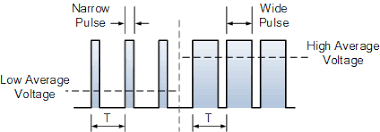
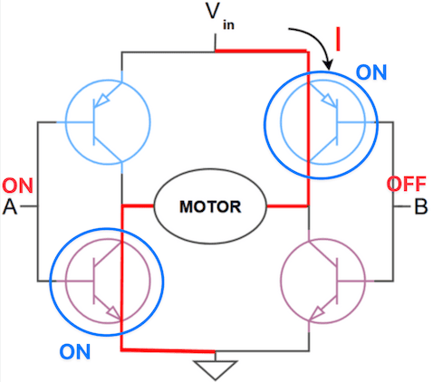
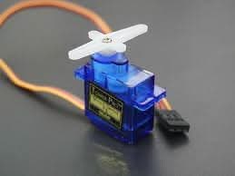
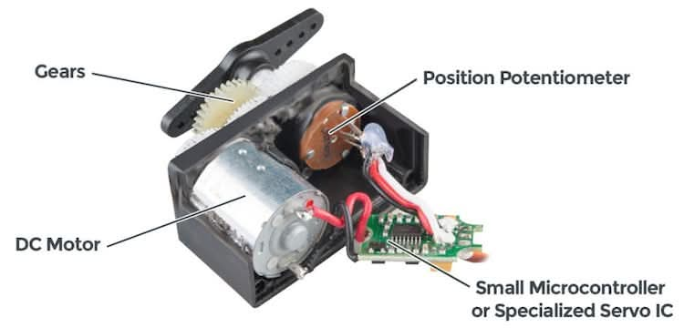
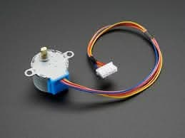
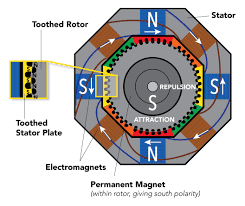
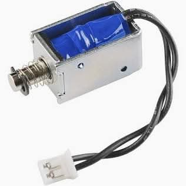
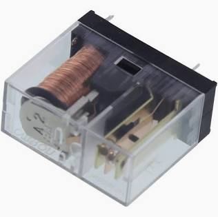
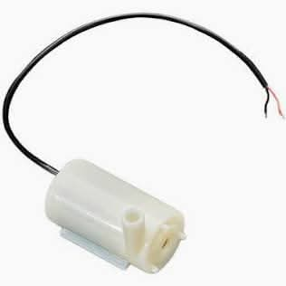

# Actuators

The Output Devices that Do the Work

---

## What Are Actuators?

> **Analogy**: If sensors are the **eyes and ears** of a system, actuators are the **hands and feet** - they convert electrical signals into physical actions.

---

### Common Actuator Types:

- **Motors**: Create rotational motion
- **Solenoids**: Create linear motion
- **Speakers**: Create sound waves
- **Pumps**: Move fluids

---

## Motors

- DC Motors
- Servo Motors
- Stepper Motors

---

### DC Motors

> **Analogy**: DC motors are like **electric drills** - they spin continuously when powered.

### Control Methods:

1. **On/Off**: Simple switching
2. **Speed Control**: PWM (Pulse Width Modulation)



---

3. **Direction Control**: H-Bridge circuit



---

### Example: DC Motor Speed Control with PWM and Potentiometer

Potentiometer is a variable resistor:


From $V = IR$, we can read the voltage across the potentiometer and use it to control the motor speed with PWM.

---

The potentiometer is connected as a voltage divider.

- The wiper (middle pin) provides a variable voltage between 0V and 5V depending on the position of the knob.

```txt
5V ──/\/\/\───┬──/\/\/\── GND
              │
             A0  ← Wiper
```

---

- The `map()` function is used to convert the potentiometer reading (0-1023) to a PWM value (0-255).

```arduino
// Motor speed control with PWM
int motorPin = 9;
int potPin = A0;

void setup() {
    pinMode(motorPin, OUTPUT);
}

void loop() {
    int potValue = analogRead(potPin);
    int motorSpeed = map(potValue, 0, 1023, 0, 255);

    analogWrite(motorPin, motorSpeed);
    delay(100);
}
```

---

### Servo Motors

> **Analogy**: Servo motors are like **precise robotic arms** - they can move to exact positions and hold them.



---

### Characteristics:

- **Precise positioning** (usually 0-180°)
- **Built-in feedback system**
- **Easy to control** with PWM signals



---

```arduino
#include <Servo.h>

Servo myServo;
int servoPin = 9;

void setup() {
    myServo.attach(servoPin);
}

void loop() {
    // Sweep from 0 to 180 degrees
    for (int pos = 0; pos <= 180; pos++) {
        myServo.write(pos);
        delay(15);
    }

    // Sweep back from 180 to 0 degrees
    for (int pos = 180; pos >= 0; pos--) {
        myServo.write(pos);
        delay(15);
    }
}
```

---

## Stepper Motors

> **Analogy**: Stepper motors are like **precise clockwork** - they move in exact, discrete steps.



---

### Advantages:

- **Exact positioning** without feedback
- **High torque** at low speeds
- **No drift** when stationary



---

```arduino
#include <Stepper.h>

const int stepsPerRevolution = 200;
Stepper myStepper(stepsPerRevolution, 8, 9, 10, 11);

void setup() {
    myStepper.setSpeed(60);  // 60 RPM
    Serial.begin(9600);
}

void loop() {
    Serial.println("Clockwise");
    myStepper.step(stepsPerRevolution);
    delay(500);

    Serial.println("Counterclockwise");
    myStepper.step(-stepsPerRevolution);
    delay(500);
}
```

---

## Solenoids and Relays

### Solenoid:

> **Analogy**: Like an **electromagnetic hammer** - when energized, it creates a strong pull or push.



---

### Relay:

> **Analogy**: Like a **remote-controlled switch** - a small electrical signal controls a much larger electrical circuit.



---

```arduino
// Controlling high-voltage device with relay
int relayPin = 7;
int buttonPin = 2;

void setup() {
    pinMode(relayPin, OUTPUT);
    pinMode(buttonPin, INPUT_PULLUP);
}

void loop() {
    if (digitalRead(buttonPin) == LOW) {
        digitalWrite(relayPin, HIGH);  // Turn on relay
        // This could control lights, motors, etc.
    } else {
        digitalWrite(relayPin, LOW);   // Turn off relay
    }
}
```

---

## Pumps

> **Analogy**: it removes the air to create suction, or pushes fluid through a system.



We use sensors to monitor fluid levels or pressure, and actuators (pumps) to maintain desired conditions.

---

## Real-World Circuit Examples

- Example 1: Smart Light System
- Example 2: Temperature-Controlled Fan
- Example 3: Security System

---

### Example 1: Smart Light System

**Components**:

- Light sensor (LDR)
- LEDs
- Transistor (for high-power LEDs)
- Resistors

**Logic**: Automatically adjust LED brightness based on ambient light

---

```arduino
// Smart lighting system
int lightSensor = A0;
int ledPin = 9;
int threshold = 500;  // Darkness threshold

void setup() {
    pinMode(ledPin, OUTPUT);
    Serial.begin(9600);
}

void loop() {
    int lightLevel = analogRead(lightSensor);

    if (lightLevel < threshold) {
        // It's dark, turn on LED gradually
        int brightness = map(lightLevel, 0, threshold, 255, 0);
        analogWrite(ledPin, brightness);

        Serial.print("Dark detected. LED brightness: ");
        Serial.println(brightness);
    } else {
        // It's bright, turn off LED
        analogWrite(ledPin, 0);
        Serial.println("Bright enough. LED off.");
    }

    delay(1000);
}
```

---

### Example 2: Temperature-Controlled Fan

**Components**:

- Temperature sensor (TMP36)
- DC motor (fan)
- Transistor (motor driver)
- Diode (flyback protection)

---

```arduino
// Temperature-controlled fan
int tempSensor = A0;
int fanPin = 9;
float targetTemp = 25.0;  // 25°C target temperature

void setup() {
    pinMode(fanPin, OUTPUT);
    Serial.begin(9600);
}

void loop() {
    // Read temperature
    int sensorValue = analogRead(tempSensor);
    float voltage = sensorValue * (5.0 / 1023.0);
    float temperature = (voltage - 0.5) * 100.0;

    // Calculate fan speed based on temperature difference
    if (temperature > targetTemp) {
        float tempDiff = temperature - targetTemp;
        int fanSpeed = constrain(tempDiff * 50, 0, 255);  // Scale factor
        analogWrite(fanPin, fanSpeed);

        Serial.print("Temp: ");
        Serial.print(temperature);
        Serial.print("°C, Fan speed: ");
        Serial.println(fanSpeed);
    } else {
        analogWrite(fanPin, 0);  // Fan off
        Serial.print("Temp: ");
        Serial.print(temperature);
        Serial.println("°C, Fan off");
    }

    delay(2000);
}
```

---

### Example 3: Security System

**Components**:

- Motion sensor (PIR)
- Buzzer
- LED indicators
- Button (arm/disarm)

---

```arduino
// Simple security system
int pirPin = 2;
int buzzerPin = 8;
int armButtonPin = 3;
int statusLedPin = 13;
bool systemArmed = false;
bool motionDetected = false;

void setup() {
    pinMode(pirPin, INPUT);
    pinMode(buzzerPin, OUTPUT);
    pinMode(armButtonPin, INPUT_PULLUP);
    pinMode(statusLedPin, OUTPUT);
    Serial.begin(9600);
}

void loop() {
    // Check arm/disarm button
    if (digitalRead(armButtonPin) == LOW) {
        systemArmed = !systemArmed;
        digitalWrite(statusLedPin, systemArmed);

        Serial.print("System ");
        Serial.println(systemArmed ? "ARMED" : "DISARMED");

        delay(500);  // Debounce
    }

    // Check for motion if system is armed
    if (systemArmed) {
        motionDetected = digitalRead(pirPin);

        if (motionDetected) {
            // Sound alarm
            digitalWrite(buzzerPin, HIGH);
            Serial.println("MOTION DETECTED! ALARM!");
        } else {
            digitalWrite(buzzerPin, LOW);
        }
    } else {
        digitalWrite(buzzerPin, LOW);  // Ensure buzzer is off when disarmed
    }

    delay(100);
}
```

---

## Summary

Now, you understand how actuators work and how to control them with microcontrollers.

- Whether it's a motor, a solenoid, or a pump, actuators are the key to making your projects come alive!
