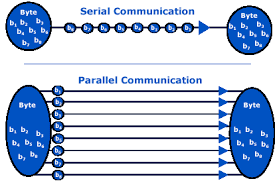
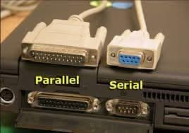
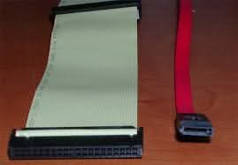

# Serial Communication

RS-232, SPI, I2C - Wired Communication Protocols

---

## What is Serial Communication?

Think of it as different ways to have conversations.

- Serial = One bit after another, like reading this sentence word by word
- Parallel = Multiple bits simultaneously, like 8 people talking at once

---

### Parallel vs Serial Analogy:

```txt
Parallel Communication (8 bits at once):
Person A: "H-E-L-L-O-!-!-!" ← All letters shouted simultaneously
Person B: Confused noise...

Serial Communication (1 bit at a time):
Person A: "H" → "e" → "l" → "l" → "o" → "!"
Person B: "Hello!" ← Clear understanding
```



---

## Why Serial Communication?

The Cable Problem:

```txt
8-bit Parallel:
Computer ════════════ Device
         8 data wires
         + clock wire
         + ground
         = 10+ wires!

Serial:
Computer ─────────── Device
         2-3 wires total
```

---

Benefits of Serial:

- Fewer wires = cheaper cables, smaller connectors
- Longer distances = less interference
- Simpler routing = easier PCB design
- Lower power = important for mobile devices

---




---

## The Winner is Serial!

- We don't use parallel communication much anymore because of the cable problem.
- Serial communication is more efficient and practical for most applications.
- We can get very high speeds with serial protocols, so there's no need for parallel in modern devices.

---

### PATA to SATA: The Shift to Serial

Even for the computer's hard drive, we moved from parallel (PATA) to serial (SATA) for better performance and reliability.



---

### Why Parallel Disappeared?

Major technical problems:

1. Clock skew

Bits arrive at slightly different times.

2. Crosstalk

Wires interfere electromagnetically.

3. Distance limits

Hard to keep signals aligned.

**As speeds increased → serial became more reliable.**

---

## Three Serial Protocols

<style scoped>
table {
  font-size: 18pt !important;
}
table thead tr {
  background-color: #aad8e6;
}
</style>

| Protocol   | Wires | Speed  | Use Case                    | Analogy              |
| ---------- | ----- | ------ | --------------------------- | -------------------- |
| **RS-232** | 2-3   | Slow   | Computer <-> Device         | Phone call           |
| **SPI**    | 4+    | Fast   | Microcontroller <-> Sensors | Teacher → Students   |
| **I2C**    | 2     | Medium | Multiple devices on bus     | Bus route with stops |

Each protocol solves different communication problems!

---

Choosing the Right Tool: We need to check more details

<style scoped>
table {
  font-size: 18pt !important;
}
table thead tr {
  background-color: #aad8e6;
}
</style>

| Feature        | RS-232        | SPI            | I2C          |
| -------------- | ------------- | -------------- | ------------ |
| **Wires**      | 2-3           | 4+             | 2            |
| **Speed**      | 115 Kbps      | 10+ MHz        | 400 Kbps     |
| **Devices**    | 2 only        | Many (with CS) | 127 max      |
| **Distance**   | Long (15m+)   | Short (PCB)    | Short (PCB)  |
| **Complexity** | Simple        | Medium         | Medium       |
| **Use Case**   | Debug console | Fast sensors   | Slow sensors |

---

### Selection Algorithm

```txt
Need long distance? ──YES──► RS-232
         │
        NO
         │
Need high speed? ──YES──► SPI
         │
        NO
         │
Multiple devices? ──YES──► I2C
         │
        NO
         │
Use RS-232 (UART)
```

---

### Common Applications & Examples

**RS-232/UART Applications:**

- **Arduino Serial Monitor** - debugging
- **GPS modules** - NMEA sentences
- **Bluetooth modules** - AT commands
- **Console access** - server management

---

**SPI Applications:**

- **SD cards** - fast file access
- **LCD/OLED displays** - smooth graphics
- **ADC/DAC** - high-speed data conversion
- **Ethernet controllers** - network communication

---

**I2C Applications:**

- **Sensor networks** - temperature, pressure, IMU
- **Real-time clocks** - timekeeping
- **EEPROM memory** - configuration storage
- **PWM controllers** - LED drivers

---

### Oscilloscope Analysis: Seeing the Signals

**RS-232 (UART):**

```txt
       ___     __  __      __          ___
Data: |   |___|  ||  |____|  |________|   |
       Idle Start  D0  D1    D7    Stop Idle
```

Slowly and asynchronously, one bit at a time, with clear start and stop bits.

---

**SPI:**

```txt
CLK:  _|‾|_|‾|_|‾|_|‾|_|‾|_|‾|_|‾|_|‾|_
MOSI: ___|||___|‾‾‾|___|‾‾‾|___|‾‾‾|___
CS:   __________________|||||||||||||||___
```

Continuous clock with data changing on edges, and chip select (CS) indicating active communication.

---

**I2C:**

```txt
SCL:  _|‾|_|‾|_|‾|_|‾|_|‾|_|‾|_|‾|_|‾|_
SDA:  ST|A6|A5|A4|A3|A2|A1|A0|R/W|ACK|SP
      └─START     ADDRESS      │  │ STOP
                               │  ACK
                               READ/WRITE
```

Only two wires, sending all the information, including the address, to all attached devices.

---

## Debugging Serial Communication

We make similar mistakes across all protocols, so let's look at common issues and how to fix them.

- Identifying the problem-solution patterns is the surest way to become an expert.
- Building 2nd brain "if-then" maps for troubleshooting is the key to mastery.

---

**Common RS-232 Problems:**

```python
# Wrong baud rate
Device A: 9600 baud   ──┐
                        ├── ❌ Gibberish received
Device B: 115200 baud ──┘
```

Solution: Check both devices use same settings

---

**Common SPI Problems:**

```cpp
// Forgot to control CS pin
digitalWrite(CS_PIN, LOW);   // Select device
SPI.transfer(data);          // Send data
// Missing: digitalWrite(CS_PIN, HIGH);  ❌ Never deselected!
```

---

**Common I2C Problems:**

```cpp
// Missing pull-up resistors
SDA ────── Device    ❌ No pull-ups
SCL ────── Device
```

Solution: Add 4.7kΩ pull-up resistors to 3.3V or 5V

---

## Project Example

**Project Goal:** Build a system using all three protocols

```txt
Computer (RS-232) ──► Arduino (Master) ──SPI──► LCD Display
                          │
                          └─────I2C─────► Temperature Sensor
```

---

### Project Steps:

1. **RS-232:** Receive commands from computer
2. **I2C:** Read temperature from sensor
3. **SPI:** Display temperature on LCD
4. **Integration:** Create command interface

---

### Skills Needed:

- Protocol selection and implementation
- Multi-device coordination
- Real-time data processing
- Hardware-software interface design

---

### Other Serial Protocols to Explore

**RS-485:** RS-232's Bigger Brother

- **Multi-device** support (up to 32 devices)
- **Longer distances** (1200m)
- **Differential signaling** (noise immunity)
- Used in industrial automation

---

**CAN Bus:** Automotive Communication

- **Error detection** and correction
- **Priority-based** message system
- **Fault-tolerant** network
- Cars, industrial control

---

**And many more...**

- **USB:** Universal Serial Bus
- **Ethernet:** Networking everything
- **Networking protocols** (TCP/IP, HTTP, MQTT)
- **Wireless communication** (WiFi, LoRa, Zigbee)
- **Industrial protocols** (Modbus, Profibus)
- **Automotive networks** (CAN, LIN, FlexRay)

---

### Practical Skills:

- **Protocol analyzers** and debugging tools
- **Embedded programming** with multiple protocols
- **System integration** and troubleshooting
- **PCB design** for communication systems

---

**Project Ideas:**

- Multi-sensor data logger
- Home automation controller
- Industrial monitoring system
- IoT gateway device

---

## Summary: Serial Communication Fundamentals

### **RS-232/UART:**

- **Point-to-point** communication
- **Simple** but versatile
- **Good for debugging** and console access

---

### **SPI:**

- **High-speed** communication
- **Master-slave** architecture
- **Best for fast peripherals**

---

### **I2C:**

- **Multi-device** on same bus
- **Address-based** communication
- **Good for sensor networks**

---

## Problem solvers must understand:

- **Timing is critical** - both sides must agree
- **Error handling** is essential
- **Hardware requirements** vary by protocol
- **Choose based on requirements**, not preferences (solve the problem, don't just use the tool you know)
