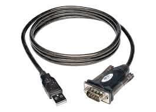
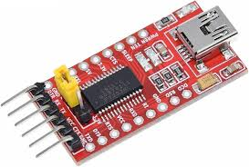

# RS-232: The Phone Call Protocol

---

**Basic Concept:**

```txt
Device A                Device B
┌──────┐               ┌──────┐
│  TX  │──────────────►│  RX  │  (A talks to B)
│  RX  │◄──────────────│  TX  │  (B talks to A)
│ GND  │───────────────│ GND  │  (Common ground)
└──────┘               └──────┘
```

**Like a phone conversation:**

- **TX (Transmit)** = Your mouth (speaking)
- **RX (Receive)** = Your ear (listening)
- **GND** = Same language/understanding

---

**UART** = Universal Asynchronous Receiver/Transmitter  
**RS-232** = Recommended Standard 232 (voltage level specification)

- No slave/master, just two equal devices talking
- Asynchronous (no clock signal, like talking without a metronome)
- Long-distance capable (up to 15m for RS-232)
- Simple and universal (used in GPS, Bluetooth, WiFi modules, sensors)

---

## RS-232 Protocols

- UART
- Voltage Levels
- MAX232 Level Converter and USB-to-Serial
- Data Format
- Configuration

---

### UART (Universal Asynchronous Receiver/Transmitter)

```txt
Device A                    Device B
┌────────┐                  ┌────────┐
│   TX   ├─────────────────→│   RX   │
│        │                  │        │
│   RX   │←─────────────────┤   TX   │
│        │                  │        │
│   GND  ├──────────────────┤   GND  │
└────────┘                  └────────┘

Important: TX of Device A → RX of Device B
           RX of Device A ← TX of Device B
           (Crossover connection!)
```

---

**Key points:**

- **TX** (Transmit): Sends data OUT
- **RX** (Receive): Receives data IN
- **GND** (Ground): Common reference (essential!)
- **Cross-connect:** TX → RX, RX → TX
- **No clock signal:** Asynchronous, timing based on agreed baud rate

---

### Voltage Levels

**TTL Serial (Modern microcontrollers)**

```txt
Logic HIGH (1):  +3.3V or +5V
Logic LOW (0):   0V (GND)

Voltage:
  5V  ────┐     ┌────┐     ┌────
          │     │    │     │
  0V  ────┴─────┘    ├─────┘
         Start  D0   D1   D2 ...
```

---

**RS-232 (Traditional computer serial ports)**

```txt
Logic HIGH (1):  -3V to -15V (typically -12V)
Logic LOW (0):   +3V to +15V (typically +12V)

Voltage:
 +12V ────┐     ┌────┐     ┌────
          │     │    │     │
 -12V ────┴─────┘    └─────┘
         Start  D0   D1   D2 ...

Note: Inverted logic compared to TTL!
```

**Important:** Need a level converter (MAX232, MAX3232) to connect TTL to RS-232!

---

### MAX232 Level Converter and USB-to-Serial

Connecting Embedded System to PC serial port (RS-232):

```txt
Embedded (TTL)          MAX232          PC (RS-232)
                                       DB-9 Connector
  TX (5V) ─────→ T1IN     T1OUT ─────→ RX (Pin 2)

  RX (5V) ←───── R1OUT    R1IN  ←───── TX (Pin 3)

  GND ───────────┬─────────────────── GND (Pin 5)
                 │
           ┌─────┴─────┐
           │  Charge   │  (Capacitors for
           │  Pumps    │   voltage conversion)
           └───────────┘
```

---

**MAX232 chip:**

- Converts 5V TTL → ±12V RS-232
- Converts ±12V RS-232 → 5V TTL
- Requires 4-5 external capacitors (1µF)
- Allows long-distance communication

---

Most modern PCs don't have RS-232 ports. Instead, we use USB-to-Serial adapters that emulate RS-232 over USB.



Arduino uses USB-to-Serial internally (FTDI, CH340, or CP2102 chip or similar) to program and communicate with the board.

---

**Why Weird Voltages?**

- Noise immunity - larger voltage swings
- Long cable runs - can travel further
- Historical reasons - from telegraph era

**Modern Reality:**

Most "RS-232" today actually uses **3.3V UART** (same concept, normal voltages)

---

### Data Format

```txt
Idle  Start  D0  D1  D2  D3  D4  D5  D6  D7  Stop  Idle
 ___     __  __      __          __  __      ___  ___
    |___|  ||  |____|  |________|  ||  |____|   ||
  ^    ^                                      ^    ^
High  Low                                   High  High
       └─ Always 0                          └─ Always 1
```

**Sending 'A' (ASCII 65 = 01000001):**

1. Idle = High voltage (no data)
2. Start bit = Low (get ready!)
3. 8 data bits = 01000001 (LSB first: 10000010)
4. Stop bit = High (finished!)
5. Idle = High (waiting for next character)

---

### Configuration

**Communication Settings (like dialing instructions):**

```python
# Both devices must agree on these settings!
baud_rate = 9600    # bits per second (like talking speed)
data_bits = 8       # usually 8 (sometimes 7)
parity = None       # error checking (None/Even/Odd)
stop_bits = 1       # end-of-character marker
flow_control = None # traffic control (None/Hardware/Software)
```

---

**Common Configurations:**

- **9600,8,N,1** = 9600 baud, 8 data bits, no parity, 1 stop bit
- **115200,8,N,1** = High-speed version

Both devices must use EXACTLY the same settings!

---

## Why UART/RS-232?

**Advantages:**

- **Simple:** Only 2 wires (TX and RX)
- **Well-established:** Decades of proven use
- **Long-distance:** Up to 15m (RS-232) or 1km+ (RS-485)
- **Universal support:** Every microcontroller has UART
- **Human-readable:** Can send ASCII text easily

---

**Common uses:**

```txt
GPS Module        → Send location data
Bluetooth Module  → Wireless communication
GSM/4G Module     → Cellular communication
Computer Debug    → Serial monitor/terminal
Arduino <-> PC      → Programming and debugging
Sensor Networks   → Simple data exchange
```

---

## Timing and Synchronization

**Calculation:**

```txt
At 9600 baud with 8N1 (10 bits per byte):
  9,600 bits/sec ÷ 10 bits/byte = 960 bytes/sec

Sending "Hello":
  5 bytes × 10 bits/byte = 50 bits
  Time = 50 bits ÷ 9,600 bps = 5.2 milliseconds
```

**Important:** Both transmitter and receiver MUST use the same baud rate!

---

```txt
Transmitter @ 9600 baud:
Each bit = 1/9600 = 104 microseconds

  ┌───┬───┬───┬───┬───┬───┬───┬───┐
  │104│104│104│104│104│104│104│104│ µs per bit
  └───┴───┴───┴───┴───┴───┴───┴───┘

Receiver @ 9600 baud: ✓ Correctly receives data
Receiver @ 19200 baud: ✗ Samples twice per bit (wrong!)
Receiver @ 4800 baud: ✗ Samples every 2 bits (wrong!)
```

**Tolerance:**

- Most UARTs tolerate ±5% baud rate mismatch
- Beyond that: garbled data
- Use accurate crystal oscillator (not internal RC)
