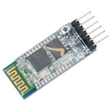
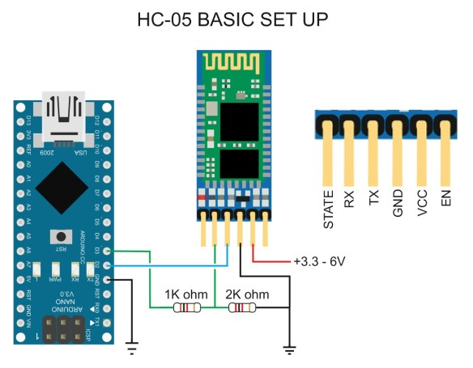
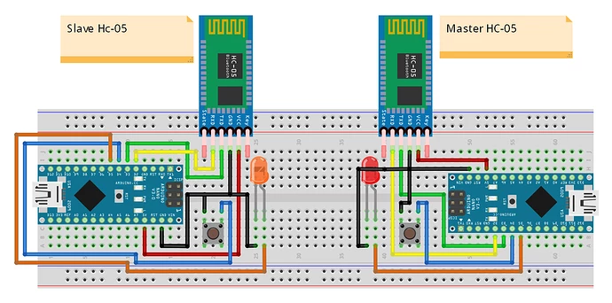

# RS-232 Practice

Code Examples

---

### Example 1: Receiving Commands

Control LED via serial commands:

```cpp
#define LED_PIN 13

void setup() {
  pinMode(LED_PIN, OUTPUT);
  Serial.begin(9600);
  Serial.println("LED Controller");
  Serial.println("Commands: ON, OFF, BLINK");
}
```

---

```cpp
void loop() {
  if (Serial.available() > 0) {
    String command = Serial.readStringUntil('\n');
    command.trim();  // Remove whitespace
    command.toUpperCase();  // Convert to uppercase

    if (command == "ON") {
      digitalWrite(LED_PIN, HIGH);
      Serial.println("LED is ON");
    }
    else if (command == "OFF") {
      digitalWrite(LED_PIN, LOW);
      Serial.println("LED is OFF");
    }
    else if (command == "BLINK") {
      for (int i = 0; i < 5; i++) {
        digitalWrite(LED_PIN, HIGH);
        delay(200);
        digitalWrite(LED_PIN, LOW);
        delay(200);
      }
      Serial.println("Blink complete");
    }
    else {
      Serial.println("Unknown command");
    }
  }
}
```

---

### Example 2: Software Serial

Using additional serial ports (pins 2 & 3):
**Use case:**

- Arduino Uno has only 1 hardware UART (pins 0 & 1)
- SoftwareSerial creates additional ports on any digital pins
- Bridge between two serial devices

---

```cpp
#include <SoftwareSerial.h>

#define RX_PIN 2
#define TX_PIN 3

SoftwareSerial mySerial(RX_PIN, TX_PIN);  // RX, TX

void setup() {
  Serial.begin(9600);      // USB serial to PC
  mySerial.begin(9600);    // Software serial to device

  Serial.println("Bridge Mode: USB <-> Device");
}

void loop() {
  // Forward data from USB to device
  if (Serial.available()) {
    char c = Serial.read();
    mySerial.write(c);
  }

  // Forward data from device to USB
  if (mySerial.available()) {
    char c = mySerial.read();
    Serial.write(c);
  }
}
```

---

## Example 3: GPS Module (NEO-6M)

Reading GPS data via serial:

```cpp
#include <SoftwareSerial.h>
#include <TinyGPS++.h>

SoftwareSerial gpsSerial(4, 3);  // RX, TX
TinyGPSPlus gps;

void setup() {
  Serial.begin(9600);
  gpsSerial.begin(9600);
  Serial.println("GPS Module Test");
}
```

---

```cpp
void loop() {
  while (gpsSerial.available() > 0) {
    gps.encode(gpsSerial.read());

    if (gps.location.isUpdated()) {
      Serial.print("Latitude: ");
      Serial.println(gps.location.lat(), 6);

      Serial.print("Longitude: ");
      Serial.println(gps.location.lng(), 6);

      Serial.print("Altitude: ");
      Serial.print(gps.altitude.meters());
      Serial.println(" m");

      Serial.print("Satellites: ");
      Serial.println(gps.satellites.value());

      Serial.println("---");
    }
  }
}
```

---

**GPS NMEA sentence example:**

```txt
$GPGGA,123519,3907.382,N,07702.479,W,1,08,0.9,545.4,M,46.9,M,,*47
```

---

## Example 4: Bluetooth Module (HC-05)

We can use wireless serial communication using HC-05 Bluetooth module:

- This module acts as a wireless serial bridge



---

### Connectiong HC-05 to Arduino:

<style>
.columns {
  display: flex;
  gap: 2rem;  
  align-items: center;
}
.column.text {
  flex: 6;
}
.column.image {
  flex: 4;
}
</style>

<div class="columns">
  <div class="column image">



  </div>

  <div class="column text">

```txt
[PC Serial Monitor]
        │ USB (Virtual Serial)
        ▼
[Arduino USB-Serial Chip]
        │ Hardware UART
        ▼
[Arduino MCU UART]
        │ TX/RX
        ▼
[HC-05 Bluetooth UART]
        ⇅ Wireless
[Other Bluetooth Device]
```

  </div>

</div>

---

### Wiring (Arduino Nano/Uno + HC-05)

<style scoped>
table {
  font-size: 18pt !important;
}
table thead tr {
  background-color: #aad8e6;
}
</style>

**HC-05 → Arduino**

| HC-05 Pin | Arduino Pin   | Meaning                             |
| --------- | ------------- | ----------------------------------- |
| VCC       | 5V            | Power                               |
| GND       | GND           | Ground                              |
| TXD       | D2 (RX)       | HC-05 TX → Arduino RX               |
| RXD       | D3 (TX)       | Arduino TX → HC-05 RX (use divider) |
| EN/KEY    | (For AT mode) | Only needed for AT mode             |
| STATE     | (not used)    | Optional status output              |

---

Notice that voltage divider is needed on the HC-05 RX line to step down 5V from Arduino D3 (TX) to 3.3V for HC-05:

```txt
HC-05 RX expects ~3.3V logic.

Arduino D3 (TX) — 1kΩ —+— HC-05 RXD
                   |
                  2kΩ
                   |
                  GND

HC-05 TXD (3.3V) → Arduino D2 is OK directly.
```

---

### Connecting Two Arduinos via Bluetooth



1. Arduino A (Master) → HC-05 (Master)
2. Arduino B (Slave) → HC-05 (Slave)

We need to use the AT mode to configure one HC-05 as Master and the other as Slave, and then pair them together.

---

### What is AT Mode?

**AT Mode = Configuration Mode**

HC-05 has two operating states:

| Mode      | Purpose                        |
| --------- | ------------------------------ |
| Data Mode | Normal Bluetooth communication |
| AT Mode   | Configuration & setup          |

---

### Why AT Mode is Needed

You must enter AT mode to change settings such as:

- Master / Slave role
- Device name
- Password
- Baud rate
- Auto-connect binding address

Example commands:

```txt
AT+ROLE=1
AT+NAME=ROBOT
AT+PSWD=1234
```

---

### Make sure to use HC-05 default settings before AT mode:

```cpp
#include <SoftwareSerial.h>
SoftwareSerial BT(2, 3); // RX, TX

void setup() {
  Serial.begin(9600);   // PC monitor
  BT.begin(38400);     // AT mode baud
  Serial.println("AT MODE TERMINAL READY");
}

void loop() {
  while (Serial.available()) BT.write(Serial.read());
  while (BT.available())     Serial.write(BT.read());
}
```

---

Serial Monitor Settings

- Baud: 9600
- Line ending: Both NL & CR

**Important:**

- HC-05 firmware uses 38400 when in AT mode
- HC-05 firmware uses 9600 when in Data mode
- Arduino must match whichever mode the module is in

---

### Enter AT Mode (Configuration Step)

AT Mode is used **only to configure** the modules.

1. Connect **KEY/EN → 3.3V**
2. Power ON the HC-05
3. LED blinks slowly (~2 sec interval)

That means AT Mode is active.

---

### Configure the SLAVE Module First

Upload the AT terminal sketch (next slide).

Open Serial Monitor → send commands:

```txt
AT
AT+ROLE=0
AT+ADDR?
```

Expected:

- `OK`
- Address shown (e.g.: +ADDR:98D3:31:F5A2B1)

---

### Configure the MASTER Module

Enter AT Mode again on the second HC-05.

Send:

```txt
AT
AT+ROLE=1
AT+CMODE=0
AT+BIND=98D3,31,F5A2B1
```

Notice that the A+BIND command uses the address from the SLAVE module.

---

<style scoped>
table {
  font-size: 18pt !important;
}
table thead tr {
  background-color: #aad8e6;
}
</style>

| Command | Meaning                      |
| ------- | ---------------------------- |
| ROLE=1  | Set as Master                |
| CMODE=0 | Connect only to bound device |
| BIND    | Target Slave address         |

---

### Switch Back to Data Mode

After configuration:

1. Disconnect KEY/EN
2. Power OFF/ON both modules

They will now auto-connect.

LED pattern changes when linked.

---

### Communication Code — Sender

Arduino A sends text every second.

```cpp
# include <SoftwareSerial.h>

SoftwareSerial BT(2, 3);

void setup() {
  Serial.begin(9600); // To PC
  BT.begin(9600); // To other HC-05 (Data mode baud)
}

void loop() {
  BT.println("Hello from Arduino A");
  delay(1000);
}
```

---

### Communication Code — Receiver

Arduino B prints received text.

```cpp
# include <SoftwareSerial.h>

SoftwareSerial BT(2, 3);

void setup() {
  Serial.begin(9600); // To PC
  BT.begin(9600); // To other HC-05 (Data mode baud)
}

void loop() {
  while (BT.available()) {
    Serial.write(BT.read());
  }
}
```
