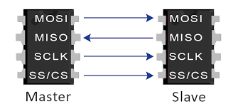
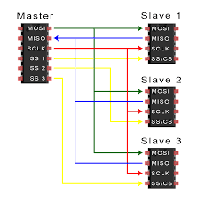
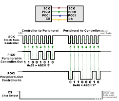
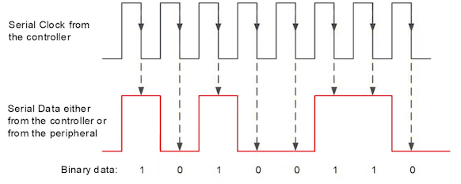
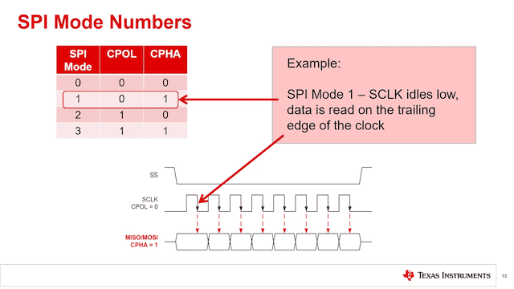
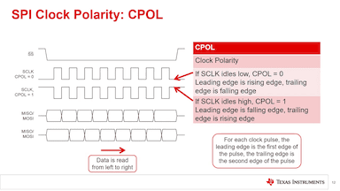
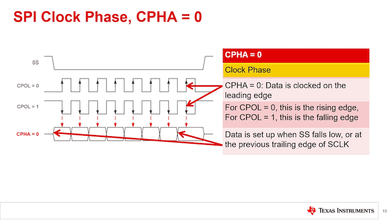
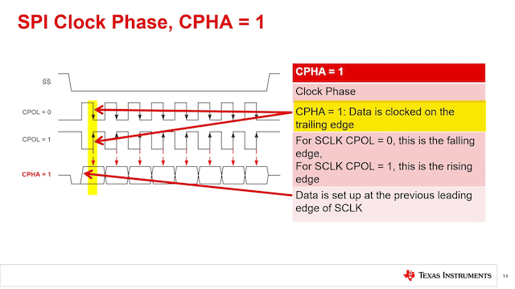

# SPI

Serial Peripheral Interface

---

## Core Concept

**SPI** = Serial Peripheral Interface  
Also known as: **4-wire serial bus**, **SSI** (Synchronous Serial Interface)

**Real analogy:** Like a high-speed assembly line where the boss (master) directly talks to each worker (slave) through dedicated connections!

---

### Why SPI?

A **high-speed** communication protocol for:

- **Fast data transfer** (up to 60+ MHz)
- **Full-duplex** communication (send & receive simultaneously)
- **Short-distance** connections (< 1 meter typically)
- **Simple protocol:** No addressing, no ACK/NACK
- **No pull-up resistors** needed

---

### The Four Signals

- **MOSI** (Master Out Slave In): Data from master to slave
- **MISO** (Master In Slave Out): Data from slave to master
- **SCK** (Serial Clock): Clock signal from master
- **SS/CS** (Slave Select/Chip Select): Selects which slave is active



---

All MOSIs are connected together, all MISOs are connected together, and the master controls which slave is active with separate SS lines.



---

**Trade-offs:**

- More wires (4+ vs 2)
- More pins used
- Each slave needs its own SS/CS line

**Use cases:**

- SD cards (high-speed storage)
- TFT displays (lots of pixel data)
- Fast ADC/DAC converters
- RF modules (NRF24L01)
- Flash memory chips

---

### Master-Slave Architecture

**Master** (usually a microcontroller):

- Generates clock (SCK)
- Initiates all communication
- Controls which slave is active (via SS lines)
- Can only be **ONE master** in basic SPI

---

**Slave** (peripherals):

- Responds when selected (SS goes LOW)
- Receives clock from master
- Cannot initiate communication
- Can be **multiple slaves** on same bus

**Chip Select (SS/CS) is active LOW:**

SS = LOW → Slave is selected and listening
SS = HIGH → Slave is deselected and ignoring bus

---

### Pin Naming Variations

<style scoped>
table {
  font-size: 18pt !important;
}
table thead tr {
  background-color: #aad8e6;
}
</style>

**Warning:** Different manufacturers use different names!

| Signal         | Common Names                  | Arduino Uno Pin |
| -------------- | ----------------------------- | --------------- |
| Master → Slave | MOSI, SDO, DO, DOUT, SO, MTSR | 11 (MOSI)       |
| Slave → Master | MISO, SDI, DI, DIN, SI, MRST  | 12 (MISO)       |
| Clock          | SCK, SCLK, CLK                | 13 (SCK)        |
| Chip Select    | SS, CS, CE, NSS               | 10 (SS)         |

---

**Modern naming (less confusing):**

- **COPI/PICO** (Controller Out Peripheral In) ← replaces MOSI
- **CIPO/POCI** (Controller In Peripheral Out) ← replaces MISO

**Example confusion:**

```txt
NRF24L01 module:
MOSI → connected to → Arduino MOSI ✓
SDI → connected to → Arduino MOSI ✓ (same signal, different name!)
```

---

## Full-Duplex Communication



---

**Key difference from I2C:** Data flows BOTH directions simultaneously!

```txt
Clock →   1   2   3   4   5   6   7   8

MOSI →    1   0   1   0   0   1   0   1   (0xA5)
MISO ←    0   0   1   1   1   1   1   1   (0x3F)
```

**Important:** Every SPI transfer is an **exchange**:

- Master sends 8 bits → Slave receives 8 bits
- Slave sends 8 bits → Master receives 8 bits
- **Happens at the same time!**

---

### Step-by-Step Example: Master sends 0xC7, Slave responds with 0x3A

```txt
Step 1: Master pulls SS LOW (selects slave)
Step 2: Master starts clock and shifts out data
MSB first: 1 1 0 0 0 1 1 1 = 0xC7
Step 3: Slave shifts out its response (simultaneously)
MSB first: 0 0 1 1 1 0 1 0 = 0x3A
Step 4: After 8 clock pulses, transfer complete
Master received: 0x3A
Slave received: 0xC7
Step 5: Master pulls SS HIGH (deselects slave)
```

---

## SPI Problem

SPI is fast so it is important to transfer data correctly.



- Data should be ready and stable when it is read.
- In this example, the data is read at the falling edge, so the data should be ready at the rising edge of the clock.

---

### Different hardware design

However, it is not easy to guarantee this timing, because different devices have different internal designs and timing requirements.

- Sensor A might make ready the signal at the rising edge, while Sensor B might make it ready at the falling edge.
- If the master reads at the wrong edge, it might read invalid data (e.g., 0x00 or 0xFF) instead of the correct value.

---

## SPI Modes

To solve this problem, SPI defines 4 modes based on:

- **Clock Polarity (CPOL)**: Idle state of the clock (0 = LOW, 1 = HIGH)
- **Clock Phase (CPHA)**: When data is sampled (0 = first edge, 1 = second edge)



---

### CPOL



---

### CPHA




---

### Different Modes for Different Devices

<style scoped>
table {
  font-size: 28px;
}
thead tr {
  background-color: #cde8ff;
}
</style>

| Device         | SPI Mode |
| -------------- | -------- |
| SD Card        | Mode 0   |
| OLED Display   | Mode 0   |
| MCP3008 ADC    | Mode 0   |
| Some RF Chips  | Mode 3   |
| DACs (various) | Mode 1/2 |

The Master must be configured to match the slave's SPI mode for correct communication!

---

## SPI: How a Slave Sends Data to a Master

Key idea:

> The **slave can send data**, but the **master must start the clock**.

---

### 1) The Big Rule

In SPI, the **master controls**:

- **SCK (Clock)**
- **SS/CS (Select)**
- **When a transfer starts**

So the slave **cannot** “talk whenever it wants.”

---

### 2) Full‑Duplex = Two Lanes at Once

Every clock tick moves data in **both** directions:

```txt
SCK:   ↑ ↑ ↑ ↑ ↑ ↑ ↑ ↑

MOSI:  Master → Slave   (outgoing)
MISO:  Slave  → Master  (incoming)
```

Even if the master sends “nothing useful,” the clock still lets the slave send.

---

### 3) The Trick: “Dummy Write” to Read

SPI has no separate “read line.”
To read, the master must **write something** to generate clock pulses.

Example idea:

- Master sends 0x00 (dummy)
- Slave uses those clocks to shift real data out on MISO

---

### 4) Byte Example (Concept)

```txt
Clocks:  1 2 3 4 5 6 7 8

MOSI :   0 0 0 0 0 0 0 0           (dummy)
MISO :   D7 D6 D5 D4 D3 D2 D1 D0   (real data)
```

Master is “asking” by providing clocks.

---

### 5) Typical Pattern: Command → Response

Many SPI devices work like this:

1. Master selects the device (CS LOW)
2. Master sends a command (e.g., “read register 0x10”)
3. Master sends dummy bytes
4. Slave replies during those dummy bytes

---

### 6) Simple Arduino‑Style Pseudocode

```cpp
digitalWrite(CS, LOW);

SPI.transfer(READ_CMD);         // request
byte value = SPI.transfer(0x00); // dummy write → real read

digitalWrite(CS, HIGH);
```

The first transfer sends the command (that the slave can decode).
That second transfer is the “slave → master” moment.

---

### 7) Polling Method (No Extra Wire)

Polling = master repeatedly checks if data is ready.

```txt
Time → → → →

Master:  check  check  check  read
Slave :   no     no     yes   data
```

---

### 8) Polling Example (Status Register)

```cpp
byte status;

do {
  digitalWrite(CS, LOW);
  SPI.transfer(READ_STATUS);
  status = SPI.transfer(0x00);
  digitalWrite(CS, HIGH);
} while ((status & 0x01) == 0);   // wait until "data ready"
```

Then read the real data.

```cpp
digitalWrite(CS, LOW);
SPI.transfer(READ_DATA);
byte data = SPI.transfer(0x00);  // clocks for reply
digitalWrite(CS, HIGH);
```

---

### 10) Polling Pros / Cons

| Polling                 | Result |
| ----------------------- | ------ |
| Easy to teach           | ✅     |
| No extra pin            | ✅     |
| Wastes CPU time         | ❌     |
| Can add delay (latency) | ❌     |

---

### 11) Interrupt Method (One Extra Wire)

Instead of “check check check”…

Slave raises a GPIO pin:

```txt
Slave  → INT pin → Master
Master → SPI read (provides clock)
```

Slave still can’t start SPI, but it **can notify**.

---

### 12) Interrupt Pros / Cons

| Interrupt             | Result |
| --------------------- | ------ |
| Fast response         | ✅     |
| Low CPU usage         | ✅     |
| Needs extra wire/pin  | ❌     |
| Slightly more complex | ❌     |

---

### 13) Summary

- The slave **cannot** start SPI transfers.
- The slave **can** send data on **MISO**.
- The master must:
  - pull **CS LOW**
  - provide **SCK clocks**
- Two common designs:
  - **Polling** (master keeps checking)
  - **Interrupt + Read** (slave signals, master reads)

---

## Clock Speed

Let's say we need to send 320x240 RGB565 image to TFT display:
Data size: 320 × 240 × 2 bytes = 153,600 bytes

@ 1 MHz: 1.2 seconds
@ 8 MHz: 0.15 seconds (8 times faster!)
@ 16 MHz: 0.075 seconds

---

Clock speed is set by the master (Arduino SPI library) and must be supported by the slave device.

- CPU 16 MHz
- Max: F_CPU/2 = 8 MHz

---

### Setting SPI Parameters in Arduino:

```cpp
// 16MHz/2 = 8MHz
SPI.setClockDivider(SPI_CLOCK_DIV2);
SPI.setDataMode(SPI_MODE0);
SPI.setBitOrder(MSBFIRST);
```

Default value for Arduino Nano (ATmega328P) SPI library is SPI_MODE0 + MSBFIRST.

Or using SPISettings:

```cpp
SPI.beginTransaction(SPISettings(8000000, MSBFIRST, SPI_MODE0)); // 8 MHz
```

---

## Examples

### Example #1: Basic SPI

Simple SPI communication:

```cpp
#include <SPI.h>

#define SS_PIN 10

void setup() {
  pinMode(SS_PIN, OUTPUT);
  digitalWrite(SS_PIN, HIGH);  // Deselect slave initially

  SPI.begin();  // Initialize SPI
  SPI.setClockDivider(SPI_CLOCK_DIV8);  // 2 MHz

  Serial.begin(9600);
}
```

---

```cpp
void loop() {
  // Send data to slave
  digitalWrite(SS_PIN, LOW);   // Select slave

  byte response = SPI.transfer(0xA5);  // Send 0xA5, receive response

  digitalWrite(SS_PIN, HIGH);  // Deselect slave

  Serial.print("Sent: 0xA5, Received: 0x");
  Serial.println(response, HEX);

  delay(1000);
}
```

**Output:**

```txt
Sent: 0xA5, Received: 0x3F
Sent: 0xA5, Received: 0x3F
```

---

### Arduino Code Example #2: SPI Settings

Configuring SPI for different devices:

```cpp
#include <SPI.h>

#define SD_CARD_CS   4
#define TFT_DISPLAY_CS 10
#define RF_MODULE_CS   7

void setup() {
  SPI.begin();

  pinMode(SD_CARD_CS, OUTPUT);
  pinMode(TFT_DISPLAY_CS, OUTPUT);
  pinMode(RF_MODULE_CS, OUTPUT);

  // Deselect all devices
  digitalWrite(SD_CARD_CS, HIGH);
  digitalWrite(TFT_DISPLAY_CS, HIGH);
  digitalWrite(RF_MODULE_CS, HIGH);
}
```

---

```cpp
void communicateWithSDCard() {
  // SD Card: Mode 0, 4 MHz, MSB first
  SPI.beginTransaction(SPISettings(4000000, MSBFIRST, SPI_MODE0));
  digitalWrite(SD_CARD_CS, LOW);

  // ... SPI transfers ...

  digitalWrite(SD_CARD_CS, HIGH);
  SPI.endTransaction();
}

void communicateWithDisplay() {
  // TFT: Mode 0, 16 MHz, MSB first
  SPI.beginTransaction(SPISettings(16000000, MSBFIRST, SPI_MODE0));
  digitalWrite(TFT_DISPLAY_CS, LOW);

  // ... SPI transfers ...

  digitalWrite(TFT_DISPLAY_CS, HIGH);
  SPI.endTransaction();
}

void communicateWithRF() {
  // NRF24L01: Mode 0, 8 MHz, MSB first
  SPI.beginTransaction(SPISettings(8000000, MSBFIRST, SPI_MODE0));
  digitalWrite(RF_MODULE_CS, LOW);

  // ... SPI transfers ...

  digitalWrite(RF_MODULE_CS, HIGH);
  SPI.endTransaction();
}
```

---

## Arduino Code Example #3: Reading from Device

Reading from MCP3008 ADC (8-channel 10-bit ADC):

```cpp
#include <SPI.h>

#define ADC_CS 10

void setup() {
  pinMode(ADC_CS, OUTPUT);
  digitalWrite(ADC_CS, HIGH);

  SPI.begin();
  SPI.setClockDivider(SPI_CLOCK_DIV16);  // 1 MHz
  Serial.begin(9600);
}
```

---

```cpp
int readADC(byte channel) {
  // MCP3008 protocol:
  // Send: [start bit][single-ended][channel][don't care bits]

  digitalWrite(ADC_CS, LOW);

  // Start bit + single-ended mode
  SPI.transfer(0x01);

  // Channel selection (D7-D4) + get first 2 bits of result
  byte highByte = SPI.transfer((channel << 4) & 0xF0);

  // Get remaining 8 bits
  byte lowByte = SPI.transfer(0x00);

  digitalWrite(ADC_CS, HIGH);

  // Combine to 10-bit result
  int result = ((highByte & 0x03) << 8) | lowByte;
  return result;
}
```

---

```cpp
void loop() {
  int value = readADC(0);  // Read channel 0

  float voltage = value * (5.0 / 1024.0);

  Serial.print("ADC Value: ");
  Serial.print(value);
  Serial.print(" = ");
  Serial.print(voltage);
  Serial.println(" V");

  delay(500);
}
```

---

## Arduino Code Example #4: SD Card

Reading file from SD card:

```cpp
#include <SPI.h>
#include <SD.h>

#define SD_CS 4

void setup() {
  Serial.begin(9600);

  if (!SD.begin(SD_CS)) {
    Serial.println("SD card initialization failed!");
    return;
  }

  Serial.println("SD card initialized.");

  // Read file
  File myFile = SD.open("test.txt");
  if (myFile) {
    while (myFile.available()) {
      Serial.write(myFile.read());
    }
    myFile.close();
  } else {
    Serial.println("Error opening file");
  }
}
```

---

```cpp
void loop() {
  // Write sensor data to SD card
  File dataFile = SD.open("datalog.txt", FILE_WRITE);

  if (dataFile) {
    int sensorValue = analogRead(A0);
    dataFile.print("Time: ");
    dataFile.print(millis());
    dataFile.print(", Value: ");
    dataFile.println(sensorValue);
    dataFile.close();
  }

  delay(1000);
}
```

---

## Arduino Code Example #5: TFT Display

Drawing on ILI9341 TFT display:

```cpp
#include <SPI.h>
#include <Adafruit_GFX.h>
#include <Adafruit_ILI9341.h>

#define TFT_CS   10
#define TFT_DC   9
#define TFT_RST  8

Adafruit_ILI9341 tft = Adafruit_ILI9341(TFT_CS, TFT_DC, TFT_RST);
```

---

```cpp
void setup() {
  tft.begin();
  tft.setRotation(3);  // Landscape

  // Fast SPI for display
  tft.fillScreen(ILI9341_BLACK);

  // Draw text
  tft.setTextColor(ILI9341_WHITE);
  tft.setTextSize(3);
  tft.setCursor(50, 100);
  tft.println("Hello SPI!");

  // Draw shapes
  tft.fillCircle(160, 120, 40, ILI9341_RED);
  tft.drawRect(20, 20, 100, 60, ILI9341_GREEN);
}
```

---

```cpp
void loop() {
  // Update display with sensor data
  int temperature = 25;  // Read from sensor

  tft.fillRect(10, 200, 300, 30, ILI9341_BLACK);
  tft.setCursor(10, 200);
  tft.print("Temp: ");
  tft.print(temperature);
  tft.print(" C");

  delay(1000);
}
```

---

## Common SPI Devices & Their Uses

### Storage Devices

```txt
SD/MicroSD Card        → Data logging, audio files
W25Q series Flash      → Program storage, file system
AT25 series EEPROM     → Configuration storage
```

---

### Displays

```txt
ILI9341 (2.4" TFT)     → 320x240 color display
ST7735 (1.8" TFT)      → 128x160 color display
Nokia 5110 LCD         → 84x48 monochrome
MAX7219 LED Matrix     → 8x8 LED displays
```

### Sensors & ADC/DAC

```txt
MCP3008                → 8-channel 10-bit ADC
ADS1256                → 24-bit high-precision ADC
MCP4921                → 12-bit DAC
BME680                 → Environment sensor (also I2C)
```

---

### Communication

```txt
NRF24L01 → 2.4GHz wireless transceiver
RFM69/RFM95 (LoRa) → Long-range radio
W5500 → Ethernet controller
ESP8266 → WiFi module (also UART)
```
