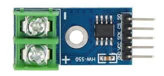
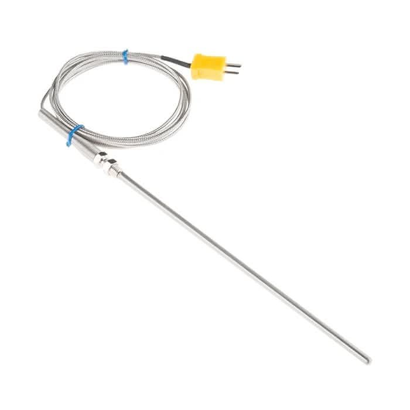
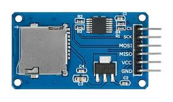
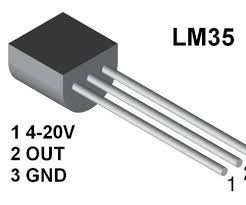
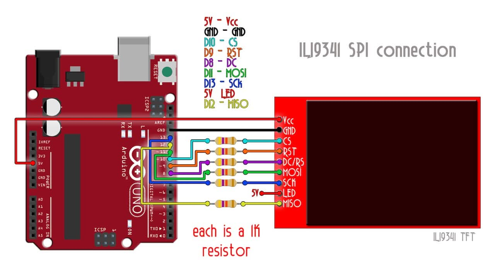
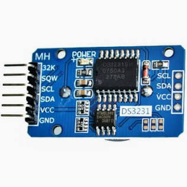
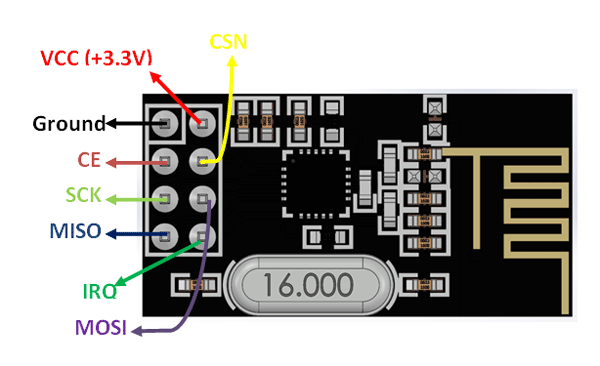

# SPI Practice

---

## SPI Projects

### Read Temperature with Digital Sensor

**Components:**

- Arduino Uno
- MAX6675 thermocouple amplifier (SPI interface)
- K-type thermocouple



---

**Wiring:**

```txt
MAX6675          Arduino
  VCC      →     5V
  GND      →     GND
  SCK      →     13 (SCK)
  CS       →     10 (SS)
  SO       →     12 (MISO)
```

---

**Code:**

```cpp
#include <SPI.h>

#define MAX6675_CS 10

void setup() {
  pinMode(MAX6675_CS, OUTPUT);
  digitalWrite(MAX6675_CS, HIGH);

  SPI.begin();
  SPI.setClockDivider(SPI_CLOCK_DIV16);  // 1 MHz
  Serial.begin(9600);
}
```

---

```cpp
float readTemperature() {
  digitalWrite(MAX6675_CS, LOW);
  delay(1);  // Wait for conversion

  uint16_t data = SPI.transfer(0x00) << 8;
  data |= SPI.transfer(0x00);

  digitalWrite(MAX6675_CS, HIGH);

  // Check for thermocouple connection
  if (data & 0x04) {
    return NAN;  // No thermocouple connected
  }

  // Extract temperature (bits 15-3)
  data >>= 3;
  float temp = data * 0.25;  // Each bit = 0.25°C
  return temp;
}
```

---

```cpp
void loop() {
  float temp = readTemperature();

  if (isnan(temp)) {
    Serial.println("Thermocouple Error!");
  } else {
    Serial.print("Temperature: ");
    Serial.print(temp);
    Serial.println(" °C");
  }

  delay(1000);
}
```

---

### Data Logger with SD Card

**Goal:** Log sensor data to SD card

**Components:**

- Arduino Uno
- SD card module
- Temperature sensor (LM35 or similar)
- Formatted SD card (FAT32)



---

```cpp
#include <SPI.h>
#include <SD.h>

#define SD_CS 4
#define TEMP_PIN A0

void setup() {
  Serial.begin(9600);

  if (!SD.begin(SD_CS)) {
    Serial.println("SD initialization failed!");
    while(1);
  }

  // Create header in file
  File dataFile = SD.open("temp_log.csv", FILE_WRITE);
  if (dataFile) {
    dataFile.println("Time(ms),Temperature(C)");
    dataFile.close();
  }
}
```

---

```cpp
void loop() {
  // Read temperature (LM35: 10mV per °C)
  int sensorValue = analogRead(TEMP_PIN);
  float voltage = sensorValue * (5.0 / 1023.0);
  float temperature = voltage * 100.0;

  // Log to SD card
  File dataFile = SD.open("temp_log.csv", FILE_WRITE);
  if (dataFile) {
    dataFile.print(millis());
    dataFile.print(",");
    dataFile.println(temperature);
    dataFile.close();

    Serial.print("Logged: ");
    Serial.print(temperature);
    Serial.println(" °C");
  }

  delay(5000);  // Log every 5 seconds
}
```

**Task:** Import CSV into Excel to plot temperature over time

---

### TFT Display Weather Station

**Components:**

- Arduino Mega (more pins for sensors)
- ILI9341 TFT display
- BME280 sensor (I2C for temp/humidity)
- DS3231 RTC (I2C for time)

---




---

**System:**

```txt
Arduino Mega
  ├─ SPI (TFT)
  │   ├─ MOSI (51)
  │   ├─ MISO (50)
  │   ├─ SCK (52)
  │   └─ CS (10)
  │
  └─ I2C (Sensors)
      ├─ SDA (20) → BME280, DS3231
      └─ SCL (21) → BME280, DS3231
```

---

```cpp
#include <SPI.h>
#include <Adafruit_ILI9341.h>
#include <Wire.h>
#include <RTClib.h>
#include <Adafruit_BME280.h>

// Read sensors via I2C
float temp = bme.readTemperature();
float humidity = bme.readHumidity();
DateTime now = rtc.now();
```

---

```cpp
// Display on TFT via SPI
tft.fillRect(0, 0, 320, 240, ILI9341_BLACK);
tft.setCursor(10, 10);
tft.setTextSize(2);
tft.print(now.hour());
tft.print(":");
tft.print(now.minute());

tft.setCursor(10, 50);
tft.print("Temp: ");
tft.print(temp);
tft.print(" C");
```

---

### Wireless Communication with NRF24L01

**Components:**

- 2x Arduino Uno
- 2x NRF24L01 modules
- Button and LED



---

```cpp
#include <SPI.h>
#include <RF24.h>

RF24 radio(9, 10);  // CE, CSN pins
const byte address[6] = "00001";

#define BUTTON_PIN 2

void setup() {
  pinMode(BUTTON_PIN, INPUT_PULLUP);
  radio.begin();
  radio.openWritingPipe(address);
  radio.setPALevel(RF24_PA_LOW);
  radio.stopListening();
}

void loop() {
  if (digitalRead(BUTTON_PIN) == LOW) {
    const char text[] = "Button!";
    radio.write(&text, sizeof(text));
    delay(200);  // Debounce
  }
}
```

---

**Receiver code:**

```cpp
#include <SPI.h>
#include <RF24.h>

RF24 radio(9, 10);
const byte address[6] = "00001";

#define LED_PIN 3

void setup() {
  pinMode(LED_PIN, OUTPUT);
  Serial.begin(9600);

  radio.begin();
  radio.openReadingPipe(0, address);
  radio.setPALevel(RF24_PA_LOW);
  radio.startListening();
}

void loop() {
  if (radio.available()) {
    char text[32] = "";
    radio.read(&text, sizeof(text));

    Serial.println(text);
    digitalWrite(LED_PIN, HIGH);
    delay(500);
    digitalWrite(LED_PIN, LOW);
  }
}
```

---

### Example: Sending image to TFT display

**Display:** 320x240 RGB565 (2 bytes per pixel)  
**Data:** 320 × 240 × 2 = 153,600 bytes

**At different speeds:**

```txt
@ 1 MHz (SPI_CLOCK_DIV16):
  Time = 153,600 bytes × 8 bits ÷ 1,000,000 bps
       = 1,228,800 bits ÷ 1,000,000
       = 1.23 seconds
  FPS = 1 / 1.23 = 0.8 fps

@ 8 MHz (SPI_CLOCK_DIV2):
  Time = 0.154 seconds
  FPS = 6.5 fps

@ 16 MHz (no divider):
  Time = 0.077 seconds
  FPS = 13 fps

@ 20 MHz (overclock):
  Time = 0.061 seconds
  FPS = 16 fps
```

**Reality check:** Add overhead for CS control, command bytes  
**Actual performance:** ~70-80% of theoretical

---

## Common SPI Problems & Solutions

### Problem 1: No Response from Slave

**Symptoms:**

```cpp
byte response = SPI.transfer(0xFF);
// response is always 0x00 or 0xFF
```

---

**Possible causes:**

1. **Wrong CS pin** → Check wiring, verify correct pin number
2. **CS not controlled properly** → Must go LOW before transfer
3. **Wrong SPI mode** → Check device datasheet for CPOL/CPHA
4. **Device not powered** → Verify power connections

---

**Solution:**

```cpp
// Verify CS pin control
pinMode(CS_PIN, OUTPUT);
digitalWrite(CS_PIN, HIGH);  // Initial state

// Use correct mode
SPI.beginTransaction(SPISettings(1000000, MSBFIRST, SPI_MODE0));
digitalWrite(CS_PIN, LOW);
// ... transfers ...
digitalWrite(CS_PIN, HIGH);
SPI.endTransaction();
```

---

### Problem 2: Garbled/Corrupted Data

**Possible causes:**

1. **Clock too fast** → Reduce SPI speed
2. **Long wires** → Use shorter connections (< 30cm)
3. **Missing ground connection** → Verify common ground
4. **Wrong bit order** → Try LSBFIRST vs MSBFIRST

---

**Solution:**

```cpp
// Start slow, then increase
SPI.beginTransaction(SPISettings(1000000, MSBFIRST, SPI_MODE0));
// If works, try 2 MHz, 4 MHz, etc.

// For long wires, add small capacitors (10-100pF) near slave
```

---

### Problem 3: Multiple Devices Interfering

**Cause:** More than one CS pin LOW at same time

**Solution:**

```cpp
// Deselect all devices before selecting one
void selectDevice(int csPin) {
  digitalWrite(SD_CS, HIGH);
  digitalWrite(TFT_CS, HIGH);
  digitalWrite(RF_CS, HIGH);

  digitalWrite(csPin, LOW);  // Select desired device
}
```

---

### Problem 4: SD Card Won't Initialize

**Common issues:**

```cpp
// Wrong CS pin
SD.begin(10);  // ← Check this matches your wiring!

// Clock too fast for initialization
SPI.setClockDivider(SPI_CLOCK_DIV2);  // ← Try slower
// SD cards need slower speed during init

// Format card as FAT32, not exFAT
```

---

### Problem 5: Display Shows Random Pixels

**TFT display issues:**

```cpp
// Voltage mismatch (5V Arduino to 3.3V display)
// Solution: Use level shifter or 3.3V Arduino

// Missing DC (Data/Command) pin control
digitalWrite(TFT_DC, LOW);   // Command mode
digitalWrite(TFT_DC, HIGH);  // Data mode

// Reset pin not connected
// Connect RST pin and add: digitalWrite(TFT_RST, HIGH);
```

---

## SPI Best Practices

### Hardware

- **Keep wires short** (< 30cm, ideally < 10cm)
- **Use twisted pairs** for MOSI/MISO and SCK/GND
- **Common ground** is essential
- **Level shifters** for 5V ↔ 3.3V devices
- **Decoupling capacitors** (0.1µF) near each device
- **Dedicated CS pin** per device (don't share!)

---

### Software

- **Always deselect** (CS HIGH) when not communicating
- **Use SPI.beginTransaction()** for correct settings
- **Check device datasheet** for mode, speed limits
- **Start slow** (1-2 MHz), then increase if stable
- **Full-duplex awareness:** every send is also a receive
- **Disable interrupts** during critical SPI operations

---

### Debugging

- **Logic analyzer** is invaluable for SPI debugging
- **Test one device** at a time before combining
- **Verify CS control** with LED or multimeter
- **Check clock polarity/phase** matches device
