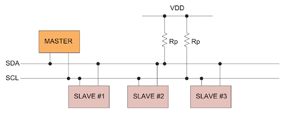
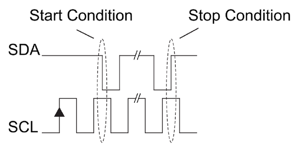
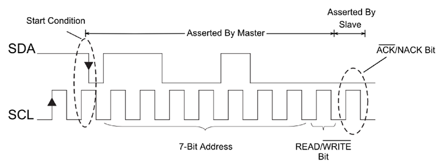
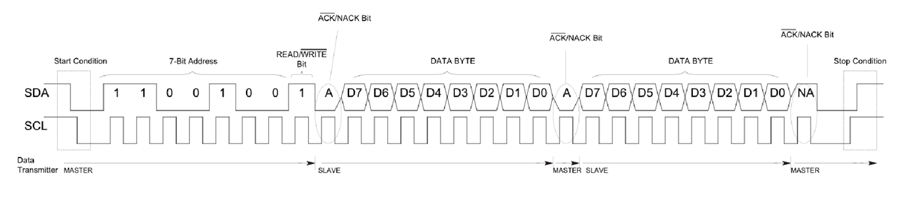
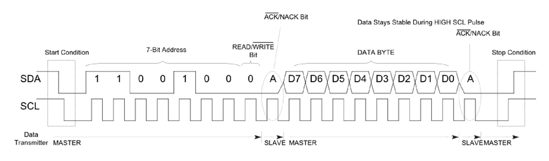
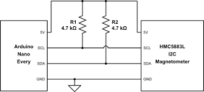
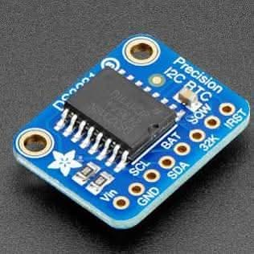
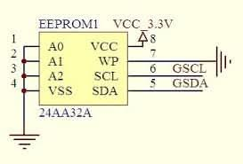
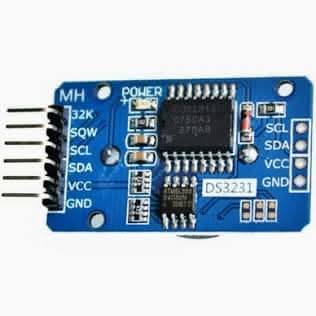

# I2C: The Bus Route Protocol

IIC(Inter-Integrated Circuit): a widely used synchronous, two-wire serial communication bus protocol

---

**I2C** = Inter-Integrated Circuit (also written as I²C or IIC)



A **2-wire** communication protocol for:

- **Short-distance** communication (< 1 meter typically)
- **Low-speed** peripherals (sensors, displays, memory chips)
- **Multiple devices** on the same bus
- **Simple wiring** with minimal pins

---

## **City Bus Analogy:**

```txt
Bus Line (2 wires shared by everyone):
SDA ═══════════════════════════════════ Data line (people getting on/off)
SCL ═══════════════════════════════════ Clock line (bus schedule)
    │           │           │
┌───▼───┐   ┌───▼───┐   ┌───▼───┐
│Arduino│   │ LCD   │   │Sensor │      Each device has unique address
│Addr:0 │   │Addr:8 │   │Addr:16│      (like house numbers on street)
└───────┘   └───────┘   └───────┘
```

**Like a bus route - one path, multiple stops, each with unique address!**

---

**Key points:**

- **SDA** (Serial Data): Bidirectional data line
- **SCL** (Serial Clock): Clock signal from master
- **Pull-up resistors** (4.7kΩ typical): Required for proper operation
- **Open-drain** outputs: Devices can only pull LOW, resistors pull HIGH

---

## Master-Slave Architecture

**Master** (usually a microcontroller):

- Controls the clock (SCL)
- Initiates all communication
- Can read from or write to slaves
- Only ONE master at a time (in simple systems)

---

**Slave** (sensors, peripherals):

- Responds when addressed
- Cannot initiate communication
- Each has a unique **7-bit address** (0x00 to 0x7F)
- Can be up to **128 devices** on one bus (practically ~10-20)

---

### I2C Address System

**Device Addressing (7-bit addresses):**

```txt
Common I2C Device Addresses:
0x08 - Arduino slave
0x27 - LCD display
0x68 - Real-time clock
0x76 - Pressure sensor
0xA0 - EEPROM memory

Address space: 0x00 to 0x7F (128 possible devices)
```

---

### **Address Collision Problem:**

```txt
❌ Wrong: Two devices with same address
LCD (0x27)  ───┬─── I2C Bus
               │
OLED (0x27) ───┘    ← Collision! Both respond!

✅ Correct: Unique addresses only
LCD (0x27)  ────┬─── I2C Bus
                │
OLED (0x3C) ────┘   ← Different addresses
```

Be careful to avoid address conflicts when connecting multiple I2C devices!

---

## I2C Communication Protocol

**Start/Stop Conditions**



**Message Format:**



---

**Step-by-Step Process:**

1. **START** - Master says "Attention everyone!"
2. **ADDRESS** - "Is device 0x27 here?"
3. **R/W bit** - "I want to READ/WRITE"
4. **ACK** - Device 0x27: "Yes, I'm here!"
5. **DATA** - Actual information transfer
6. **ACK** - "Got it!" or "Send more!"
7. **STOP** - "Conversation over"

**Like calling someone's name in a crowded room!**

---

## I2C Communication Sequence

### Complete Transaction

```txt
1. START condition
2. Address byte (7-bit address + R/W bit)
3. ACK from slave
4. Data byte(s)
5. ACK after each byte
6. STOP condition
```

---

**Example: Reading temperature from sensor at 0x76**

```txt
Master → START
Master → [0x76 << 1 | 1]  ← Address + Read bit
Slave  → ACK
Slave  → [0x1F]           ← Temperature high byte
Master → ACK
Slave  → [0xC8]           ← Temperature low byte
Master → NACK             ← No more data needed
Master → STOP

Result: Temperature = 0x1FC8 = 8,136 (needs scaling)
```

---

**When NACK is used:**

- Slave doesn't recognize the address → NACK
- Slave's buffer is full → NACK
- Master finished reading → NACK (signals "no more data please")

---

### Data Read Clock Diagram

From slave (0x64), the master reads (0) 1 byte with ACK (0), and then another byte, then NACK (1) to signal end of reading, followed by STOP condition.



---

### Data Write Clock Diagram

Master writes (0) to slave (0x64) with ACK (0) from the slave after each byte, and then STOP condition.



---

## I2C Pull-up Resistors: The Foundation



**Pull-ups ensure the bus is "HIGH" when nobody is talking**
**Devices can only "pull down" to communicate**

---

## I2C Code Example (Arduino)

```cpp
#include <Wire.h>

#define DEVICE_ADDRESS 0x27

void setup() {
  Wire.begin();        // Join I2C bus as master
  Serial.begin(9600);
}
```

---

```cpp
void i2c_write_data(uint8_t address, uint8_t data) {
  Wire.beginTransmission(address);  // Start, send address
  Wire.write(data);                 // Send data
  uint8_t error = Wire.endTransmission();  // Stop

  if (error == 0) {
    Serial.println("✅ Transmission successful");
  } else {
    Serial.print("❌ Error code: ");
    Serial.println(error);
  }
}

uint8_t i2c_read_data(uint8_t address) {
  Wire.requestFrom(address, 1);     // Request 1 byte from device

  if (Wire.available()) {
    return Wire.read();             // Read the byte
  } else {
    Serial.println("❌ No data received");
    return 0;
  }
}
```

---

```cpp
void loop() {
  i2c_write_data(DEVICE_ADDRESS, 0x42);      // Send command
  delay(10);
  uint8_t response = i2c_read_data(DEVICE_ADDRESS);  // Read response

  Serial.print("Response: 0x");
  Serial.println(response, HEX);
  delay(1000);
}
```

---

## I2C Speed Modes

<style scoped>
table {
  font-size: 18pt !important;
}
table thead tr {
  background-color: #aad8e6;
}
</style>

| Mode       | Max Speed  | Typical Use Case               |
| ---------- | ---------- | ------------------------------ |
| Standard   | 100 kbit/s | Most sensors, simple devices   |
| Fast       | 400 kbit/s | Faster sensors, small displays |
| Fast Plus  | 1 Mbit/s   | High-speed sensors             |
| High-Speed | 3.4 Mbit/s | Rare, special applications     |
| Ultra Fast | 5 Mbit/s   | Very rare, unidirectional only |

---

**Arduino default:** 100 kHz (Standard mode)  
**Can be changed:** `Wire.setClock(400000);` for Fast mode

**Example speed calculation:**

```txt
Sending one byte at 100 kHz:
  1 START + 8 data bits + 1 ACK + 1 STOP = 11 bits
  Time = 11 bits ÷ 100,000 bits/s = 110 microseconds
```

---

## Arduino Code Example

## Example #1: I2C Scanner

Find all connected I2C devices:

```cpp
#include <Wire.h>

void setup() {
  Wire.begin();        // Initialize I2C as master                                                .
  Serial.begin(9600);
  Serial.println("I2C Scanner");

  for (byte addr = 1; addr < 127; addr++) {
    Wire.beginTransmission(addr);
    byte error = Wire.endTransmission();

    if (error == 0) {
      Serial.print("Device found at 0x");
      if (addr < 16) Serial.print("0");
      Serial.println(addr, HEX);
    }
  }
  Serial.println("Scan complete");
}

void loop() {}
```

---

**Output example:**

```txt
I2C Scanner
Device found at 0x27
Device found at 0x68
Device found at 0x76
Scan complete
```

---

### Example #2: Reading Sensor

DS3231 RTC has a built-in temperature sensor. It can be read via I2C at address 0x68.



---

```cpp
#include <Wire.h>

#define DS3231_ADDR 0x68
#define TEMP_REGISTER 0x11  // Temperature register address

void setup() {
  Wire.begin();
  Serial.begin(9600);
}
```

---

```cpp
void loop() {
  Wire.beginTransmission(DS3231_ADDR);
  Wire.write(TEMP_REGISTER); // Point to temperature register
  Wire.endTransmission();

  Wire.requestFrom(DS3231_ADDR, 2); // Read 2 bytes

  if (Wire.available() >= 2) {
    int8_t temp_msb = Wire.read(); // Integer part
    uint8_t temp_lsb = Wire.read(); // Fractional part

    float temperature = temp_msb + (temp_lsb >> 6) * 0.25;

    Serial.print("Temperature: ");
    Serial.print(temperature);
    Serial.println(" °C");
  }

  delay(1000);
}
```

---

Remember the AHT10 example? It uses the library getEvent() function to read both humidity and temperature in one call:

```cpp
void loop() {
  sensors_event_t humidity, temp;
  aht.getEvent(&humidity, &temp);  // read sensor

  Serial.print("Temperature: ");
  Serial.print(temp.temperature);
  Serial.println(" °C");

  Serial.print("Humidity: ");
  Serial.print(humidity.relative_humidity);
  Serial.println(" %RH");

  delay(1000);
}
```

---

### Example #3: Writing to EEPROM

Writing data to external EEPROM (AT24C32):

This module has DS3231 RTC and AT24C32 EEPROM on the same I2C bus, but with different addresses (0x68 for RTC, 0x50 for EEPROM).



---

```cpp
#include <Wire.h>

#define EEPROM_ADDR 0x50

void writeEEPROM(uint16_t memAddr, uint8_t data) {
  Wire.beginTransmission(EEPROM_ADDR);
  Wire.write((uint8_t)(memAddr >> 8));   // Address high byte
  Wire.write((uint8_t)(memAddr & 0xFF)); // Address low byte
  Wire.write(data);                       // Data byte
  Wire.endTransmission();
  delay(5);  // EEPROM write time
}
```

---

```cpp
uint8_t readEEPROM(uint16_t memAddr) {
  Wire.beginTransmission(EEPROM_ADDR);
  Wire.write((uint8_t)(memAddr >> 8));
  Wire.write((uint8_t)(memAddr & 0xFF));
  Wire.endTransmission();

  Wire.requestFrom(EEPROM_ADDR, 1);
  return Wire.available() ? Wire.read() : 0xFF;
}

void setup() {
  Wire.begin();
  Serial.begin(9600);

  // Write "Hello" to EEPROM
  writeEEPROM(0x0000, 'H');
  writeEEPROM(0x0001, 'e');
  writeEEPROM(0x0002, 'l');
  writeEEPROM(0x0003, 'l');
  writeEEPROM(0x0004, 'o');

  // Read back
  for (int i = 0; i < 5; i++) {
    Serial.print((char)readEEPROM(i));
  }
  Serial.println();  // Output: Hello
}

void loop() {}
```

---

## Real I2C Communication Capture

Using logic analyzer to capture I2C traffic:

**Writing 0x12 to register 0x05 at device 0x68:**

```txt
Decoded Protocol View:
───────────────────────────────────────────────────────
Time    │ Event
───────────────────────────────────────────────────────
0.00ms  │ START
0.05ms  │ Address: 0x68 (Write)
0.50ms  │ ACK (from slave)
0.55ms  │ Data: 0x05 (register address)
1.00ms  │ ACK (from slave)
1.05ms  │ Data: 0x12 (data to write)
1.50ms  │ ACK (from slave)
1.55ms  │ STOP
───────────────────────────────────────────────────────

Waveform View:
SDA: ‾╲__[0 1 1 0 1 0 0 0]_[0 0 0 0 0 1 0 1]_[0 0 0 1 0 0 1 0]_/‾
        S    0x68+W      A     0x05      A     0x12      A P
```

**Total time:** ~1.55 ms at 100 kHz

---

## Common I2C Devices & Their Uses

### Sensors

```txt
BME280 (0x76/0x77)     → Temperature, Humidity, Pressure
MPU6050 (0x68/0x69)    → Accelerometer + Gyroscope
BH1750 (0x23/0x5C)     → Light intensity sensor
VL53L0X (0x29)         → Time-of-Flight distance sensor
INA219 (0x40-0x4F)     → Current/Voltage sensor
```

---

### Displays

```txt
SSD1306 (0x3C/0x3D)    → 128x64 OLED display
LCD with PCF8574 (0x27) → 16x2 or 20x4 character LCD
```

### Real-Time Clocks

```txt
DS3231 (0x68)          → Accurate RTC with temperature
DS1307 (0x68)          → Basic RTC
```

### Memory & I/O

```txt
AT24C series (0x50-0x57) → EEPROM memory
PCF8574 (0x20-0x27)      → 8-bit I/O expander
PCA9685 (0x40-0x7F)      → 16-channel PWM driver
```
