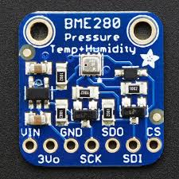
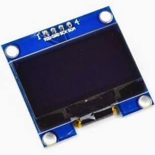

# I2C Practice

Code Examples

---

## I2C Projects

---

### Read Temperature from Sensor

**Components:**

- Arduino
- BME280 or BMP280 sensor
  

---

**Code:**

```cpp
#include <Wire.h>
#define BME280_ADDR 0x76

void setup() {
  Wire.begin();
  Serial.begin(9600);

  // Initialize BME280
  Wire.beginTransmission(BME280_ADDR);
  Wire.write(0xF4);  // ctrl_meas register
  Wire.write(0x27);  // Normal mode, temp+pressure sampling
  Wire.endTransmission();
}

void loop() {
  // Read temperature (simplified - see library for full implementation)
  Wire.beginTransmission(BME280_ADDR);
  Wire.write(0xFA);  // temp_msb register
  Wire.endTransmission();

  Wire.requestFrom(BME280_ADDR, 3);
  long temp_raw = ((long)Wire.read() << 12) |
                  ((long)Wire.read() << 4) |
                  ((Wire.read() >> 4) & 0x0F);

  // Apply calibration (simplified)
  float temp = temp_raw / 5120.0 - 10.0;

  Serial.print("Temperature: ");
  Serial.println(temp);
  delay(1000);
}
```

**Task:** Modify code to also read humidity and pressure

---

### Display on OLED Screen

**Components:**

- Arduino
- SSD1306 OLED Display (128x64)



---

```cpp
#include <Wire.h>
#include <Adafruit_SSD1306.h>

#define SCREEN_WIDTH 128
#define SCREEN_HEIGHT 64
#define OLED_RESET -1
#define SCREEN_ADDRESS 0x3C

Adafruit_SSD1306 display(SCREEN_WIDTH, SCREEN_HEIGHT, &Wire, OLED_RESET);

void setup() {
  if(!display.begin(SSD1306_SWITCHCAPVCC, SCREEN_ADDRESS)) {
    Serial.println(F("SSD1306 allocation failed"));
    for(;;);
  }

  display.clearDisplay();
  display.setTextSize(2);
  display.setTextColor(SSD1306_WHITE);
  display.setCursor(0, 0);
  display.println("Hello");
  display.println("I2C!");
  display.display();
}

void loop() {
  // Add scrolling text or sensor data display
}
```

---

### Multi-Device System

**Goal:** Create a weather station with multiple I2C devices

**Components:**

- Arduino Uno
- BME280 (Temperature, Humidity, Pressure) at 0x76
- SSD1306 OLED Display at 0x3C
- DS3231 RTC at 0x68

**System diagram:**

```txt
Arduino Uno
  ├─ SDA ─┬─ BME280 (0x76)
  │       ├─ OLED (0x3C)
  │       └─ RTC (0x68)
  │
  └─ SCL ─┴─ (Same connections)
```

**Task:**

1. Read temperature, humidity from BME280
2. Read time from DS3231
3. Display all information on OLED
4. Update display every second

**Challenge:** Add button to toggle between different display modes

---

## I2C Timing Calculations

### Example: Reading 100 bytes at 100 kHz

```txt
Per byte transaction:
  START:      1 bit
  Address:    8 bits + 1 ACK = 9 bits
  Data:       8 bits + 1 ACK = 9 bits
  STOP:       1 bit
  Total:      20 bits per byte

For 100 bytes:
  Time = (20 bits × 100) ÷ 100,000 bits/s = 2000 ÷ 100,000 = 20 milliseconds

At 400 kHz:
  Time = 2000 ÷ 400,000 = 5 milliseconds
```

---

**Practical consideration:**

- Add processing time between bytes (~10-100µs)
- Real-world: 100 bytes takes ~25-30 ms at 100 kHz

---

## I2C Best Practices

### Hardware

- **Always use pull-up resistors** (4.7kΩ is standard)
- **Keep wires short** (< 1 meter, ideally < 30cm)
- **Use twisted pair** for long runs
- **Add 0.1µF capacitors** near each device VCC
- **Separate I2C ground** from noisy motor grounds

---

### Software

- **Check return values** from Wire functions
- **Use Wire.endTransmission(false)** for repeated start
- **Add timeouts** for critical applications
- **Keep interrupts disabled** during I2C operations
- **Start at 100 kHz**, only increase if needed

### Debugging

- **Use I2C scanner** first to verify connections
- **Check with oscilloscope/logic analyzer** if available
- **Test one device at a time** before combining
- **Verify power supply** (stable 3.3V or 5V)

---

## Common I2C Problems & Solutions

### Problem 1: No ACK (Device Not Found)

**Symptoms:**

```cpp
Wire.endTransmission() returns 2  // NACK on address
```

---

**Possible causes:**

1. **Wrong address** → Check datasheet, try alternative address
2. **Missing pull-up resistors** → Add 4.7kΩ resistors to SDA/SCL
3. **Device not powered** → Check power connections
4. **Wrong pins** → Arduino Uno uses A4(SDA), A5(SCL)

**Solution:**

```cpp
// Run I2C scanner to find actual address
// Check with multimeter: SDA/SCL should read ~3-5V when idle
```

---

### Problem 2: Random Failures / Data Corruption

**Possible causes:**

1. **Cable too long** → Keep under 1 meter
2. **Pull-up resistors wrong value** → Use 4.7kΩ (2.2kΩ - 10kΩ range)
3. **EMI interference** → Route I2C lines away from motors/power
4. **Speed too high** → Reduce from 400kHz to 100kHz

---

**Solution:**

```cpp
Wire.setClock(100000);  // Slow down to 100 kHz
// Add decoupling capacitors (0.1µF) near each device
```

---

### Problem 3: Bus Lockup (SCL/SDA Stuck Low)

**Cause:** Slave device holding SDA low (in middle of transaction)

**Solution:**

```cpp
// Reset I2C bus by toggling SCL manually
pinMode(SCL_PIN, OUTPUT);
for (int i = 0; i < 9; i++) {
  digitalWrite(SCL_PIN, HIGH);
  delayMicroseconds(10);
  digitalWrite(SCL_PIN, LOW);
  delayMicroseconds(10);
}
Wire.begin();  // Re-initialize
```
